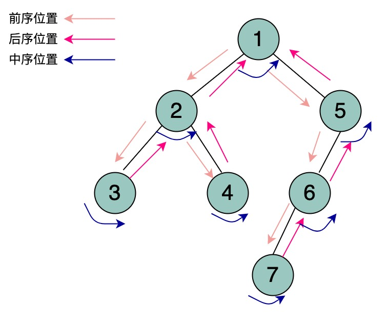
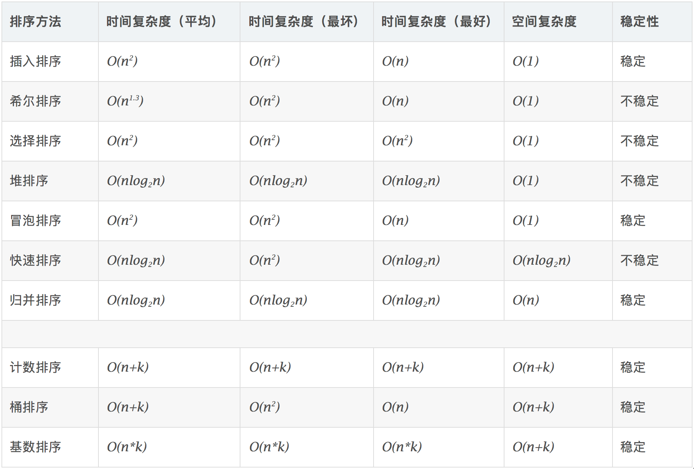

## 算法基础

## 结构化思维
### 排序
**归并排序**
```go
func sort(nums []int, left int, right int){
	mid := (left + right)>>1
	sort(nums, left, mid)   //nums[left, mid]
	srot(nums, mid+1, right) //nums[mid+1, right]
	
	//合并，后序遍历的位置
	merge(nums, left, mid, right)
}
```
****
**快速排序**
```go
func sort(nums []int, left, right){
	// 前序遍历的位置
	// 通过交换数据找到分界点，也就是先排好一个数据
	p := partition(nums, left, right)
	
	sort(nums, left, p-1)
	sort(nums, p+1, right)
}
```

### 二叉树
**前中后序遍历**
```go
func traverse(root *TreeNode){
	if (root == nil){
		return
    }
	//todo: 前序遍历的位置
	traverse(root.Left)
	//todo: 中序遍历的位置
	traverse(root.Right)
	//todo: 后序遍历的位置
}
```

****
**思考：数组、链表的遍历**
```go
// 数组迭代遍历
func traverse(arr []int){
	for i := 0; i < len(arr); i++ {
		
    }
}

// 数组的递归遍历
func traverse(arr []int, i int){
	if i == len(arr) {
		return
    }
    // 前序位置
	traverse(arr, i+1)
	// 后序位置
}

// 单链表的迭代遍历
func traverse(head *ListNode) {
	for p := head; p != nil; p = p.Next {
	    	
    }
}

// 单链表的递归遍历
func traverse(head *ListNode){
	if head != nil {
	    return	
    }
	// 前序位置
	traverse(head.Next)
    // 后序位置
}
```
**图解:**
- 【链表、数组】前、后序位置


- 【二叉树】前、中、后序位置




## 动画网站
- [Data Structure Visualizations](https://www.cs.usfca.edu/~galles/visualization/Algorithms.html)
- [visualgo](https://visualgo.net/zh)

## [排序](./sort/Readme.md)
