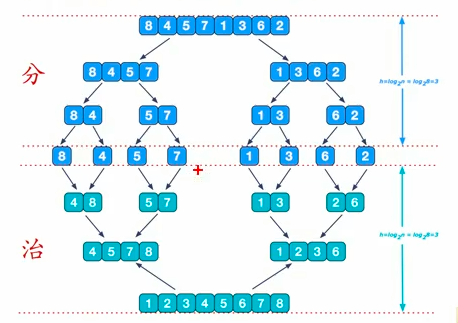
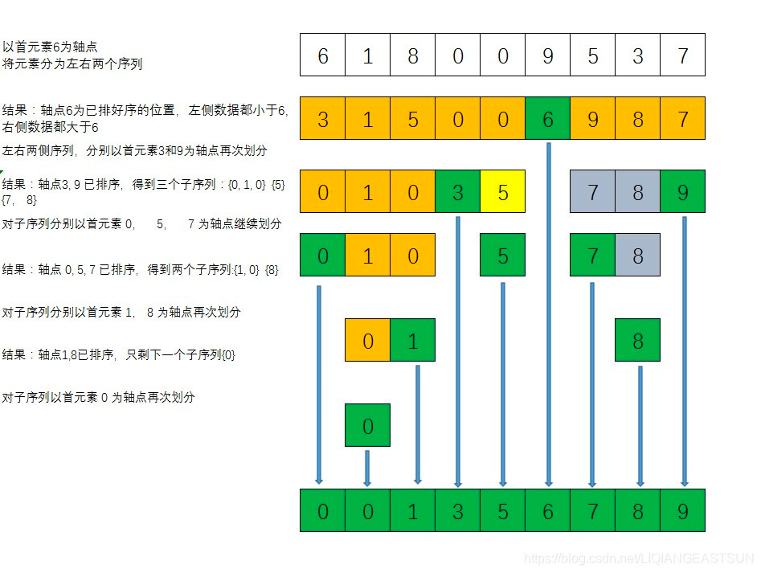

## 排序算法

### 1. 归并排序
#### 1.1 核心思想
- 二叉树的后序遍历
- 关键字： 分组，合并
  1. 把长度为n的输入序列分成两个长度为n/2的子序列；
  2. 对这两个子序列分别采用归并排序；
  3. 将两个排序好的子序列合并成一个最终的排序序列

#### 1.2 伪代码逻辑
```go
func mergeSort(nums []int) []int {
	if len(nums) < 2 {
		return nums
	}
	mid := len(nums)>>1
	left := mergeSort(nums[:mid])
	right := mergeSort(nums[mid:])
	
	// 合并两个有序的数组, 也就是后序操作
	return merge(left, right)
}
```

#### 1.3 对应分治思想图



### 2. 快速排序
#### 2.1 核心思想
- 二叉树的前序遍历
- 快速排序是先将一个元素排好序，然后再将剩下的元素排好序。
- 算法关键字： 从数组中挑选基准值，
  1. 从数列中挑出一个元素，称为 “基准”（pivot）；
  2. 重新排序数列，所有元素比基准值小的摆放在基准前面，所有元素比基准值大的摆在基准的后面（相同的数可以到任一边）。在这个分区退出之后，该基准就处于数列的中间位置。这个称为分区（partition）操作；
  3. 递归地（recursive）把小于基准值元素的子数列和大于基准值元素的子数列排序。

#### 2.2 伪代码逻辑
```go
// 这里用的都是左闭右闭区间
func quickSort(nums []int, left, right int) {
    for left < right {
		// 二叉树dfs遍历中的前序位置
        p := partArr(nums, left, right)
        
		// 这里的区间都是闭合的
		quickSort(nums, left, p-1)
		quickSort(nums, p+1, right)
    }	
	return nums
}
```

#### 2.3 快速排序逻辑图


#### 2.4 快速排序优化
- 数据较少的时候用希尔排序
- 选取的节点尽量平分数组