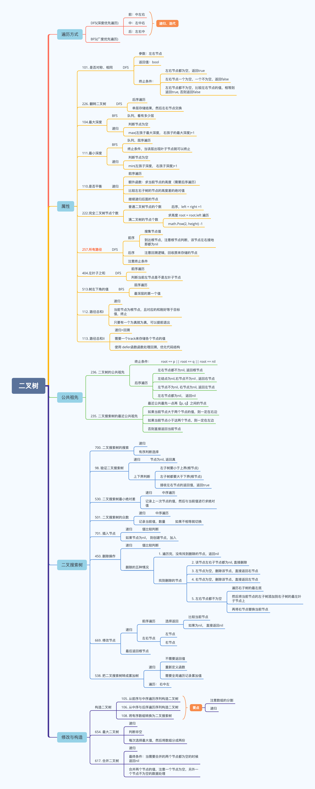

[TOC]

## 二叉树

### 递归
**三要数**
- 参数、返回值
- 终止条件
- 单层逻辑

**递归的本质**
- 每一次递归调用都会把函数的局部变量、参数值和返回值地址等压入调用栈中
- 返回时，从栈顶弹出上一次递归的各项参数，所以这就是递归可以返回上一层位置的原因

### [遍历](binaryTreeRange/main.go)


#### 递归遍历
- [前序遍历](binaryTreeRange/main.go#L16)
- [中序遍历](binaryTreeRange/main.go#L34)
- [后序遍历](binaryTreeRange/main.go#L53)

#### 迭代遍历
- [前序遍历](binaryTreeRange/main.go#L74)
- [中序遍历](binaryTreeRange/main.go#L104)
- [后序遍历](binaryTreeRange/main.go#L130)

### 层序遍历
- [bfs](binaryTreeRange/main.go#L162)

### 树的递归函数的注意点
#### 1. 怎么确定树的叶子节点
```go
if node.Left == nil && node.Right == nil {
	//todo
}
```
#### 2.怎么确定最左子节点
```go
if node.Left != nil && node.Left.Left == nil && node.Left.Right == nil {
	//todo
}
```
#### 3. 怎么得到满二叉树的高度
```go
h := 0
for node != nil {
	node = node.Left
	h++
}
//todo
```
#### 4. 怎么判断当前节点下面的子树是满二叉树
```go
leftHeight, rightHeight := 0, 0
for lNode != nil {
	lNode = lNode.Left
	leftHeight++
}
for rNode != nil {
	rNode = rNode.Right
	rightHeight++
}
if leftHeight == rightHeight {
	//todo
}
```
#### 5. 如何构建二叉树
```go
// 1. 先找到根节点
// 2. 再递归左边
// 3. 递归右边
// 4. 返回根节点
```
#### 6. 什么时候需要返回值
- 如果需要遍历整棵树，递归函数就不能有返回值
- 如果需要遍历某一条固定路线，递归函数就一定要有返回值


### 二叉树总结



### [LeetCode二叉树层序遍历](levelOrderTraversal/main.go)
- [102.二叉树的层序遍历](https://leetcode.cn/problems/binary-tree-level-order-traversal/)
- [107.二叉树的层次遍历II](https://leetcode.cn/problems/binary-tree-level-order-traversal-ii/)
- [199.二叉树的右视图](https://leetcode.cn/problems/binary-tree-right-side-view/)
- [637.二叉树的层平均值](https://leetcode.cn/problems/average-of-levels-in-binary-tree/)
- [429.N叉树的层序遍历](https://leetcode.cn/problems/n-ary-tree-level-order-traversal/)
- [515.在每个树行中找最大值](https://leetcode.cn/problems/find-largest-value-in-each-tree-row/)
- [116.填充每个节点的下一个右侧节点指针](https://leetcode.cn/problems/populating-next-right-pointers-in-each-node/)
- [117.填充每个节点的下一个右侧节点指针II](https://leetcode.cn/problems/populating-next-right-pointers-in-each-node-ii/)
- [104.二叉树的最大深度](https://leetcode.cn/problems/maximum-depth-of-binary-tree/)
- [111.二叉树的最小深度](https://leetcode.cn/problems/minimum-depth-of-binary-tree/)

### [二叉树的修改与构造](binaryTreeMake/main.go)
- [226.反转二叉树](https://leetcode.cn/problems/invert-binary-tree/)
- [101.对称二叉树](https://leetcode.cn/problems/symmetric-tree/)
- [222. 完全二叉树的节点个数](https://leetcode.cn/problems/count-complete-tree-nodes/)
- [110. 平衡二叉树](https://leetcode.cn/problems/balanced-binary-tree/)
- [257. 二叉树的所有路径](https://leetcode.cn/problems/binary-tree-paths/)
- [404.左叶子节点之和](https://leetcode.cn/problems/sum-of-left-leaves/)
- [513. 找树左下角的值](https://leetcode.cn/problems/find-bottom-left-tree-value/)
- [112. 路径总和](https://leetcode.cn/problems/path-sum/)
- [113. 路径总和 II](https://leetcode.cn/problems/path-sum-ii/)

### [二叉树构建](binaryTreeModify/main.go)
- [106. 从中序与后序遍历序列构造二叉树](https://leetcode.cn/problems/construct-binary-tree-from-inorder-and-postorder-traversal/)
- [105. 从前序与中序遍历序列构造二叉树](https://leetcode.cn/problems/construct-binary-tree-from-preorder-and-inorder-traversal/)
- [654. 最大二叉树](https://leetcode.cn/problems/maximum-binary-tree/)
- [617.合并二叉树](https://leetcode.cn/problems/merge-two-binary-trees/)

### [二叉搜索树](binarySearchTree/main.go)
- [700. 二叉搜索树中的搜索](https://leetcode.cn/problems/search-in-a-binary-search-tree/)
- [98. 验证二叉搜索树](https://leetcode.cn/problems/validate-binary-search-tree/)
- [530. 二叉搜索树的最小绝对差](https://leetcode.cn/problems/minimum-absolute-difference-in-bst/)
- [501. 二叉搜索树中的众数](https://leetcode.cn/problems/find-mode-in-binary-search-tree/)
- [701. 二叉搜索树中的插入操作](https://leetcode.cn/problems/insert-into-a-binary-search-tree/)
- [450. 删除二叉搜索树中的节点](https://leetcode.cn/problems/delete-node-in-a-bst/)
- [669. 修剪二叉搜索树](https://leetcode.cn/problems/trim-a-binary-search-tree/)
- [108. 将有序数组转换为二叉搜索树](https://leetcode.cn/problems/convert-sorted-array-to-binary-search-tree/)
- [538. 把二叉搜索树转换为累加树](https://leetcode.cn/problems/convert-bst-to-greater-tree/)


### [二叉树公共祖先问题](commonAncestor/main.go)
- [236. 二叉树的最近公共祖先](https://leetcode.cn/problems/lowest-common-ancestor-of-a-binary-tree/)
- [235. 二叉搜索树的最近公共祖先](https://leetcode.cn/problems/lowest-common-ancestor-of-a-binary-search-tree/)