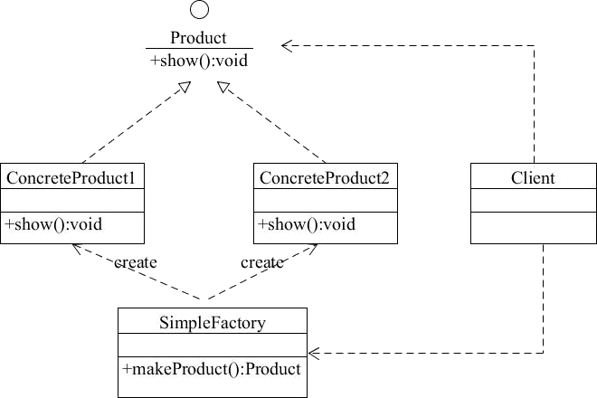
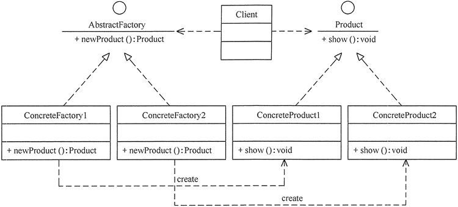
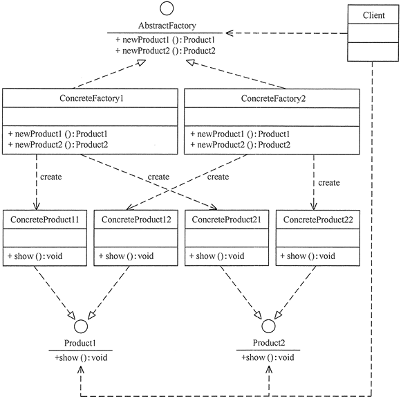
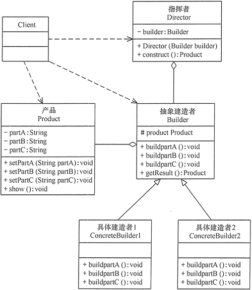

# go语言设计模式
`
参考地址： 
1. https://github.com/senghoo/golang-design-pattern
2. http://c.biancheng.net/view/1348.html
`

## 创建型模式(6种)
### 简单工厂模式(simple factory)
#### 1. 优点
- 工厂类包含必要的逻辑判断，可以决定在什么时候创建哪一个产品的实例。客户端可以免除直接创建产品对象的职责，很方便的创建出相应的产品。工厂和产品的职责区分明确。
- 客户端无需知道所创建具体产品的类名，只需知道参数即可。
- 也可以引入配置文件，在不修改客户端代码的情况下更换和添加新的具体产品类。
#### 2. 缺点
- 简单工厂模式的工厂类单一，负责所有产品的创建，职责过重，一旦异常，整个系统将受影响。且工厂类代码会非常臃肿，违背高聚合原则。
- 使用简单工厂模式会增加系统中类的个数（引入新的工厂类），增加系统的复杂度和理解难度
- 系统扩展困难，一旦增加新产品不得不修改工厂逻辑，在产品类型较多时，可能造成逻辑过于复杂
- 简单工厂模式使用了 static 工厂方法，造成工厂角色无法形成基于继承的等级结构。
#### 3. 应用
- 对于产品种类相对较少的情况，考虑使用简单工厂模式。使用简单工厂模式的客户端只需要传入工厂类的参数，不需要关心如何创建对象的逻辑，可以很方便地创建所需产品。
#### 4. 实现逻辑

- 简单工厂（SimpleFactory）：是简单工厂模式的核心，负责实现创建所有实例的内部逻辑。工厂类的创建产品类的方法可以被外界直接调用，创建所需的产品对象。
- 抽象产品（Product）：是简单工厂创建的所有对象的父类，负责描述所有实例共有的公共接口。
- 具体产品（ConcreteProduct）：是简单工厂模式的创建目标。

### 工厂方法模式(factory method)
#### 1. 优点
- 用户只需要知道具体工厂的名称就可得到所要的产品，无须知道产品的具体创建过程。 
- 灵活性增强，对于新产品的创建，只需多写一个相应的工厂类。 
- 典型的解耦框架。高层模块只需要知道产品的抽象类，无须关心其他实现类，满足迪米特法则、依赖倒置原则和里氏替换原则。
#### 2. 缺点
- 类的个数容易过多，增加复杂度
- 增加了系统的抽象性和理解难度
- 抽象产品只能生产一种产品，此弊端可使用抽象工厂模式解决。
#### 3. 应用场景
- 客户只知道创建产品的工厂名，而不知道具体的产品名。如 TCL 电视工厂、海信电视工厂等。
- 创建对象的任务由多个具体子工厂中的某一个完成，而抽象工厂只提供创建产品的接口。
- 客户不关心创建产品的细节，只关心产品的品牌
#### 4. 实现逻辑

- 抽象工厂（Abstract Factory）：提供了创建产品的接口，调用者通过它访问具体工厂的工厂方法 newProduct() 来创建产品。 
- 具体工厂（ConcreteFactory）：主要是实现抽象工厂中的抽象方法，完成具体产品的创建。
- 抽象产品（Product）：定义了产品的规范，描述了产品的主要特性和功能。
- 具体产品（ConcreteProduct）：实现了抽象产品角色所定义的接口，由具体工厂来创建，它同具体工厂之间一一对应。

### 抽象工厂模式(abstract factory)
#### 1.定义
- 是一种为访问类提供一个创建一组相关或相互依赖对象的接口，且访问类无须指定所要产品的具体类就能得到同族的不同等级的产品的模式结构。

#### 2.优点
- 可以在类的内部对产品族中相关联的多等级产品共同管理，而不必专门引入多个新的类来进行管理。
- 当需要产品族时，抽象工厂可以保证客户端始终只使用同一个产品的产品组。
- 抽象工厂增强了程序的可扩展性，当增加一个新的产品族时，不需要修改原代码，满足开闭原则。

#### 3.缺点
- 当产品族中需要增加一个新的产品时，所有的工厂类都需要进行修改。增加了系统的抽象性和理解难度。

#### 4.实现逻辑
- 抽象工厂（Abstract Factory）：提供了创建产品的接口，它包含多个创建产品的方法 newProduct()，可以创建多个不同等级的产品。
- 具体工厂（Concrete Factory）：主要是实现抽象工厂中的多个抽象方法，完成具体产品的创建。
- 抽象产品（Product）：定义了产品的规范，描述了产品的主要特性和功能，抽象工厂模式有多个抽象产品。
- 具体产品（ConcreteProduct）：实现了抽象产品角色所定义的接口，由具体工厂来创建，它同具体工厂之间是多对一的关系。

### 创建者模式(builder)
#### 1.定义
- 将一个复杂的对象的构造与它的表示分离，使同样的构建过程可以创建不同的表示
- 它是将一个复杂的对象分解为多个简单的对象，然后一步一步构建而成

#### 2.优点
- 封装性好，构建和表示分离。
- 扩展性好，各个具体的建造者相互独立，有利于系统的解耦。
- 客户端不必知道产品内部组成的细节，建造者可以对创建过程逐步细化，而不对其它模块产生任何影响，便于控制细节风险。

#### 3.缺点
- 产品的组成部分必须相同，这限制了其使用范围。
- 如果产品的内部变化复杂，如果产品内部发生变化，则建造者也要同步修改，后期维护成本较大。

#### 4.工厂模式的关注点不同
- 建造者模式注重零部件的组装过程， 
- 而工厂方法模式更注重零部件的创建过程，但两者可以结合使用。

#### 5.实现细节
- 产品角色（Product）：它是包含多个组成部件的复杂对象，由具体建造者来创建其各个零部件。
- 抽象建造者（Builder）：它是一个包含创建产品各个子部件的抽象方法的接口，通常还包含一个返回复杂产品的方法 getResult()。
- 具体建造者(Concrete Builder）：实现 Builder 接口，完成复杂产品的各个部件的具体创建方法。
- 指挥者（Director）：它调用建造者对象中的部件构造与装配方法完成复杂对象的创建，在指挥者中不涉及具体产品的信息。

### 原型模式(prototype)
### 单例模式(singleton)

## 结构型模式(7种)
### 外观模式(Facade)
### 适配器模式(adapter)
### 代理模式(proxy)
### 组合模式(composite)
### 享元模式(flyweight)
### 装饰模式(decorator)
### 桥模式(bridge)

## 行为型模式
### 中介者模式(mediator)
### 观察者模式(observer)
### 命令模式(command)
### 迭代器模式(iterator)
### 模板方法模式(template method)
### 策略模式(strategy)
### 状态模式(state)
### 备忘录模式(memento)
### 解释器模式(interpreter)
### 责任链模式(chain of responsibility)
### 访问者模式(visitor)

