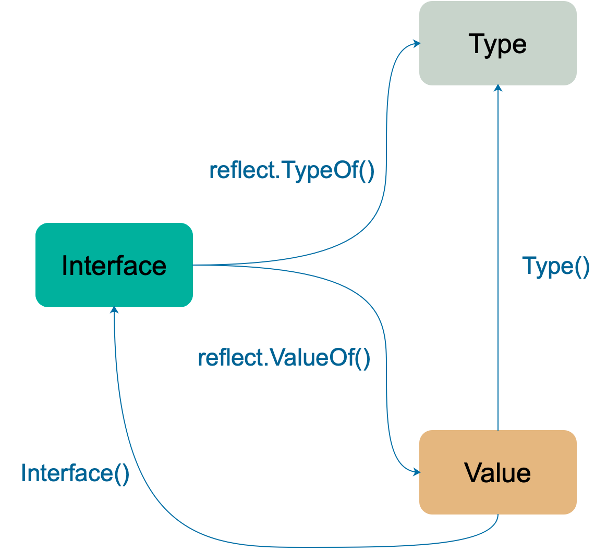
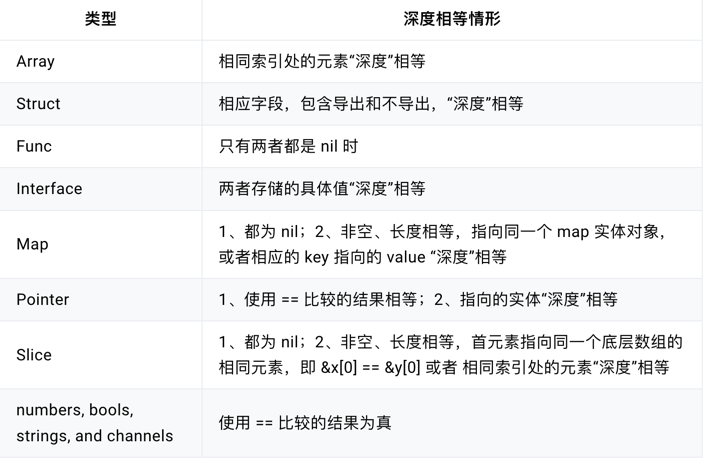
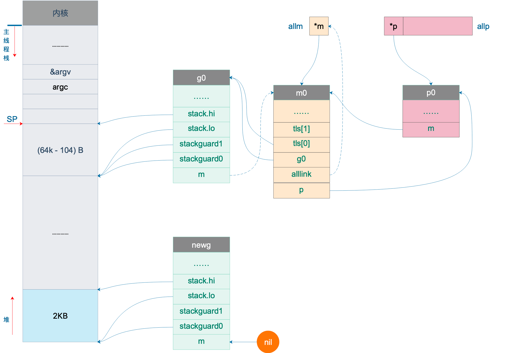
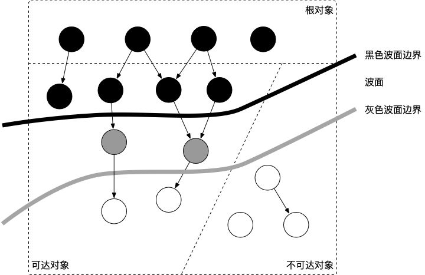

## go基础
### 数组与切片
- 对比
  - 数组为固定长度，不能修改，是一片连续的内存
  - 切片是一个结构体，含有三个字段(长度，容量，底层数组)
    - 底层数组是一个指针 `unsafe.Pointer`
    - len切片元素的数量，cap切片容量
- 切片扩容逻辑
  - 如果传入的cap大于doublecap，则直接使用传入的cap
    - `append([]int{}, 1,2,3,4,5)` 操作后，len=5, cap=6
  - v1.18之前
    - `old.cap < 1024` 2倍老容量 `newcap = doublecap`
    - `old.cap > 1024` 1.25倍老容量 `newcap = 1.25*old.cap`
  - v1.18之后
    - `old.cap < 256` 2倍老容量 `newcap = doublecap`
    - `old.cap > 256` `newcap = old.cap + (old.cap+3*256)/4`
  - 后面也会进行内存对齐操作
- 切片作为函数的参数
  - 当切片作为一个参数的时候，其实就像一个结构体作为函数的参数
  - 注意：
    - slice底层数据在数组上，slice存储的是一个指针
    - 传参的时候，尽快slice的数据没发生改变，也就是指针没变
    - 但是`s[i]=10`这种操作直接改变了数组的值，因此内容也发生了变化

### 哈希表

#### 哈希函数
- 分类
  - 加密类，md5、sha1、sha256
  - 非加密类，查找类
- 考察点
  - 性能
  - 碰撞概率
  
#### map的get的两种操作[编译器处理]
- mapaccess1 返回一个值
- mapaccess2 返回两个值

#### map为啥无序
- 扩容时，会发生key的搬迁
- 遍历会从一个随机的序号bucket开始，bucket对应的cell也是随机开始

#### 什么样的类型可以作为map的key
- 可比较的类型
- 除了slice、map、function等
- 注意
  - 引用类型的值，hash出来的值不一定相等
  - float类型作为key要注意的问题

#### 可以边遍历边删除吗？
- map不是一个数据安全的数据结构
  - 同一个协程内边读边写问题不大
  - 每次操作，会检测写标识，会直接panic
- sync.RWMutex
- 可以使用sync.map

#### 可以对map的元素取地址吗？
- 不可以，编译器不能通过
- 通过unsafe.Pointer等获取地址，不能长期持久，扩容会发生变动

#### map可以比较相等吗？
- 不可以，编译器不通过
- 深度相等条件
  - 都为nil
  - 非空，长度相等，指向同一个map实体对象
  - 相应的key,指向value深度相等


### 接口
#### go语言与鸭子类型的关系
- duck typing 定义
  - 动态语言的一种对象推测策略，它更关注对象能如何被使用，而不是对象的类型本身
- 通过interface实现
  - 不要求类型显示地声明实现了某个接口，只要实现了相关的方法即可，编译器就能检测到
  - 实际操作就是编译器在其中做了隐匿的转换工作

#### 值接受与指针接收有啥区别
- 区别
  - 值类型调用
    - 值方法，拷贝副本，类似"传值"
    - 指针方法，编译器会做处理，使用值的引用来调用，进行转换`(&qcrao).growup()`
  - 指针类型调用
    - 值方法，指针被解析为引用的值，也就是转成`(*stefno).hello()`
    - 实际是拷贝了一份指针，方法的操作会影响调用者。
- 总结
  - 如果实现了接收者是值类型的方法，会隐含的实现接收者是指针类型的方法
    - 如果接收者是指针类型的方法，编译器自动生产一个接收者是值类型的方法，这样在值类型的调用的时候，原本期望修改调用者的就没法实现
  - 修不修改对象本身不是由调用者对象类型(值、指针)来决定的，而是有方法的接收者决定的
- 使用场景
  - 使用指针接收者是的理由
    - 方法能够修改接收者指向的值
    - 避免每次调用方法时复制该值，大结构体更加高效

#### iface与eface的区别
- 动态类型(tab)
- 动态值(data)
- 如果打印出接口的动态类型和值
  - unsafe.Pointer

#### 编译器如何检测类型实现了某个接口
- 检测`*myWriter`是否实现了 `io.Writer`接口
  - `var _ io.Writer = (*myWriter)(nil)`
- 检测`myWriter`是否实现了`io.Writer`接口
  - `var _ io.Writer = myWriter{}`
- 总结
  - 上述赋值语句会发生隐式地类型转换，
  - 在转换的过程中，编译器会检测等号右边的类型是否实现了等号左边接口所规定的函数。

#### 类型转换与类型断言
- 本质
  - 把一个类型转换成另一个类型
- 类型转换
  - 前后两个类型要相互兼容才行
  - 语法：<结果类型> := <目标类型>(<表达式>)
- 类型断言
  - interface{}没有任何函数，go所有类型都实现了空接口
  - 当一个函数的形参是空接口时，需要对形参进行断言，从而得到它的真实类型
  - 语法：<目标类型值>, <布尔值> := <表达式>.(目标类型) // 安全类型断言
  - 不同之处：类型断言是对接口变量进行操作

#### 通过接口实现多态
- 多态特点(一种运行期的行为)
  - 一种类型具有多种类型的能力
  - 允许不同的对象对同一消息做出灵活的反应
  - 以一种通用的方式对待使用的对象
  - 非动态语言必须通过继承和接口的方式来实现

#### go语言编译快的原因
- 使用import的引用管理方式
- 更少的关键字，减少了编译器的复杂度
- 没有泛型，没有模版编译的负担
- 1.5版本之后的自举编译器优化


### 通道
#### 什么是CSP
- csp并发模型
  - 不要通过共享内存来通信，而是通过通信来实现内存共享
  - 通过 `goroutine` 和 `channel` 来实现
  - 提供一种线程安全的数据结构

#### 底层的数据结构是什么
- `hchan` 分析
  - 有一个环形数组buf，用来存放缓冲区的数据，配合`sendx`,`recvx`来控制环形队列
  - `sendq` 和 `recvq` 分别表示阻塞的goroutine, 这个goroutine表示正在读取channel或向channel发送数据被阻塞
  - 阻塞的链表为双向链表，而`sudog`是对goroutine的封装
  - makeChan() 返回的一个指针类型

#### channel的相关操作
- chanSend
- chanRecv
- closeChan
- makeChan

#### 如何优雅的关闭channel
- 不优雅的原因
  - 因为无法知道channel的状态，
  - 关闭一个已关闭的channel会报错，向一个已关闭的channel写数据也会报错
- 关闭channel的原则
  - 不要在receiver则关闭channel
  - 不要在多个sender时关闭channel
  - 原因：因为sender可以决定何时不发数据，并且关闭channel
- 不够优雅的方法
  - 使用`defer-recover`机制
  - 使用`sync.Once`只关闭一次
- 优雅的关闭方法
  - 分多种情况(sender、receiver的关系)
  - 中间channel+select配合模式来关闭

#### channel数据的发送与接收的本质
- "值的拷贝"

#### 什么情况会引起goroutine泄露
- goroutine操作channel后，处于发送或接收阻塞状态，channel处于满或空的状态一直得不到改变
- 对于一个channel，如果没有任何goroutine引用，gc会对其进行回收操作，不会引起内存泄露

#### 关于channel的happened-before有哪些？
- channel的状态
  - send(发送)
  - send finished(发送完成)
  - receive(接收)
  - receive finished(接收完成)
- happened-before的关系
  - 第n个 send 一定 happened before 第 n 个 receive finished，无论是缓冲型还是非缓冲型的 channel。
  - 对于容量为 m 的缓冲型 channel，第 n 个 receive 一定 happened before 第 n+m 个 send finished。
  - 对于非缓冲型的 channel，第 n 个 receive 一定 happened before 第 n 个 send finished。
  - channel close 一定 happened before receiver 得到通知。

#### channel的应用
- 停止信号
- 任务定时
  - 超时控制(select+time+channel)
  - 定时执行某个任务(time+select)
- 解耦生产者和消费者
- 并发控制(缓冲区channel)
  - 控制放在函数内部与外部有差异


### context
#### context是什么
- 主要用于goroutine传递上下文信息
  - 取消信号
  - 超时时间
  - 截止时间
  - k-v信息(并发安全的数据结构)

#### context.Value的值查找过程
- 理解 `valueCtx` 结构体
  - String() 方法
  - Value方法，实际就是一个递归查找的过程，一直向上查找
- 创建 `valueCtx`的方法
  - 函数签名 `WithValue(ctx Context, key, val interface{}) context`
- 总结
  - 递归查询的过程
  - 低效，覆盖问题
  - 建议不要使用context传值

#### context如何被取消

- `cancel()`方法实现的逻辑
  - 关闭channel, 也就是c.done
  - 递归的取消所有的子context, 也就是遍历`c.children` 然后执行`child.cancel()`
  - 从父节点上删除自己，调用`removeChild()`
- 创建可取消的context方法
  - `WithCancel(ctx Context) (ctx Context, cancel CancelFunc)`
- timerCtx
  - 基于cancelCtx 只是多了一个time.Timer和一个deadline
  - 创建方法
    - `WithTimeout(parent Context, timeout time.Duration)(Context, CancelFunc)`


### 反射
#### 什么是反射？
- 定义
  - 计算机程序在运行时，可以访问，检测，修改它本身状态或行为的一种能力
  - 程序在运行时能够"观察"并且修改自己的行为
- 不用反射就不能访问观察修改自己本身了吗？
  - 本质：运行时，探知对象的类型信息和内存结构
  - 不用反射，汇编语言可以，高级语言不行
- go语言运行时的反射
  - 运行时，更新变量和检查它们的值，调用它们的方法，编译时，并不知道这些变量的具体类型，这种称反射机制

#### 什么情况下需要使用反射？
- 场景
  - 不能明确接口调用哪个函数，需要根据传入的参数在运行时决定
  - 不能明确传入函数的参数类型，需要在运行时处理任意对象
- 不建议使用反射
  - 反射代码可读性差
  - 静态语言，编译器能提前发现错误，如果使用反射，编译器就无能为力，如果一些panic会很严重
  - 性能影响大

#### go语言反射的实现原理
- 反射的基本类型
  - `reflect.Type` 接口类型，提供了很多函数，主要是类型相关的信息
  - `reflect.Value` 结合_type和data两者，可以获取，或者改变类型的值
- 基本函数
  - `reflect.TypeOf(i interface()) Type`
  - `reflect.ValueOf(i interface()) Value`

- 反射基础
  - reflect包定义了各种类型，各种函数，用来处理运行时，检测类型的信息，改变类型的值
  - 反射是建立在类型的基础上，反射就是通过接口类型信息实现的
- 反射的三大定律
  - 反射是一种检测存储在interface中类型和值机制，可以通过`TypeOf`和`ValueOf`函数得到
  - 可以将`ValueOf`返回值通过`Interface()`反向转变成interface变量
    - 也就是说接口类型变量与反射类型对象可以相互转换
  - 如果需要操作一个反射变量，那么它必须是可设置的
    - 反射变量可设置的本质是它存储了原变量本身，这样对反射变量的操作，就会反映到原变量本身
    - 如果反射变量不能代表原变量，那么操作了反射变量，不会对原变量产生影响

#### go语言反射有哪些应用
- IDE代码自动补全
- 对象序列化(encoding/json)
- fmt相关函数实现
- ORM(Object Relational Mapping对象关系映射)

#### 如何比较对象深度相等



### unsafe
#### go指针和unsafe.Pointer有什么区别
- 指针的一些限制
  - 指针不能进行数学运算
  - 不同类型的指针不能相互转换
  - 不同类型的指针不能使用==或!=来比较
  - 不同类型的指针不能相互赋值
- unsafe包提供两种重要的能力
  - 任何类型的指针和unsafe.Pointer可以相互转换
  - uintptr类型可以和unsafe.Pointer可以相互转换

- 注意点
  - uintptr并没有指针的语义，uintptr所指向的对象会被gc无情的回收
  - unsafe.Pointer有指针语义，会在有用的时候不会被GC

#### 如何利用unsafe获取slice&map的长度
- 获取slice长度
  - `&s -> Pointer -> uintptr -> 修改偏移量 -> Pointer -> *int ->int`
- 获取map的长度
  - 因为count是二级指针
  - `&m -> Pointer -> **int -> int`

#### 如果利用unsafe修改私有成员
- 结构体成员变量修改的策略
  - 通过`offset()`函数，可以获得结构体成员的偏移量，进而获取成员的地址，读写该地址的内存，就可以达到改变该成员值的目的
  - 结构体会被分配到一块连续的内存，结构体的地址也代表了第一个成员的地址

#### 实现字符串与slice之间零拷贝
- 利用指针的强转，这样就可以实现zero-copy
- `*(*[]byte)(unsafe.Pointer(&s))`  字符串转换成切片
- `*(*string)(unsafe.Pointer(&b))`  切片转换成string


### 调度器
#### goroutine和线程的区别
- 内存分配
- 创建与销毁
- 切换

#### 什么是schedule?
- GPM
- sysmon检测执行时间过长的goroutine
- goroutine的几种常用状态
  - waiting     等待状态(io事件，系统调用，同步条件ready)
  - runnable    就绪状态
  - executing   运行状态
- M:N模型

#### schedule的调度时机有哪些
- go func
- gc
  - 执行gc的goroutine也在M上运行
  - gc只会回收堆上的内存
- 系统调用
  - 发生阻塞
- 阻塞协程切换
  - atomic, mutex
  - channel
  - time
  - io

#### 什么是工作窃取
- 调度器的职责
  - 将runnable的goroutine均匀的分布在P上运行的M
- work-stealing
  - 当自己的本地队列没有可运行的g, 就会从其他的p上偷取一些g来运行
- 找到可用的goroutine就会一直执行，直到发生阻塞才会进行切换

#### GPM是什么
- G goroutine 
  - stack
  - gobuf
- M 
  - 没有工作，自旋检测
    - 全局队列
    - 网络
    - Gc任务
    - 偷取任务
- P
  - 提供上下文信息，保存M执行G时的一些资源
    - 本地队列
    - Memory cache
  - 一个M只有绑定P才能执行goroutine

#### schedule的初始化过程
- `schedt`结构体，保存调度相关状态，全局可运行的G队列
  - `ngsys` goroutine 的数量，自动更新
  - `maxmcount` 表示最多所能创建的工作线程数量
  - `mcount` 已经创建的工作线程数量
  - `nmidle` 空闲的工作线程数量
  - 全局可运行的 G队列
- 一些全局变量
  - `allglen`  所有 g 的长度
  - `allgs`  保存所有的 g
  - `allm` 保存所有的 m
  - `allp` 保存所有的 p，_MaxGomaxprocs = 1024
  - `sched` 调度器结构体对象，记录了调度器的工作状态
  - `m0`  代表进程的主线程
  - `g0` m0 的 g0，即 m0.g0 = &g0
- 系统可执行文件的加载过程
  - 从磁盘上读取可执行的文件加载到内存中
  - 创建进程和主线程
  - 为主线程分配栈空间
  - 把由用户在命令行输入的参数拷贝到主线程的栈
  - 把主线程放入操作系统的运行队列等待被调度
- `-gcflags "-N -l"` 关闭编译器优化和函数内联

#### 主goroutine如何被创建


#### 调度循环

#### g0栈如何切换

#### goroutine如何退出

#### M如何工作

#### sysmon后台监控线程做了什么


### 垃圾回收期
#### 垃圾回收的认识
- 什么是gc
  - 一种自动的内存管理机制
  - 不需要对内存进行手动的申请和释放操作，几乎对程序员不可见
- 组件介绍
  - Mutator 用户的代码，对象的引用关系
  - Collector 负责执行垃圾回收的代码
- 根对象是什么(标记过程中最先检测的对象)
  - 全局变量
  - 执行栈(栈变量，指向分配的堆内存区块的指针)
  - 寄存器

#### 常见的Gc有哪些，go用的gc是啥？
- 分类
  - 追踪(Tracing)
    - 从根对象出发，根据对象的引用信息，扫描整个堆，确定需要保留的对象，从而回收可回收的对象
    - GO,JAVA,V8,JavaScript实现的是追踪式GC
  - 引用计数
    - 每个对象包含一个被引用的计数器，当计算器归零时自动得到回收，缺陷较多，在追求性能的语言通常不被应用
    - Python,Objective-C
- 追踪式的实现方式
  - 标记清扫
    - 从根对象出发，将确定存活的对象进行标记，并清扫可以回收的对象
  - 标记整理
    - 为了解决内存碎片问题，将对象尽可能整理到一块连续的内存上
  - 增量式
    - 将标记与清扫过程分批执行，每次执行很少的部分，从而增量进行回收，
  - 增量整理
    - 在增加的基础上，增加对象整理过程
  - 分代式
    - 将对象根据存活时间进行长短分类，年轻代，老年代，永久代
- 引用计数
  - 根据对象的引用计数来回收，当引用计数归零时就进行回收
- go语言的实现
  - 无分代
  - 不整理(回收不对对象整理移动)
  - 并发(与用户代码并发执行)的三色标记清扫算法
- go采用不整理原因
  - 使用基于TcMalloc,基本上没啥碎片

#### 三色标记是什么？
- 三种不同类型的对象
  - 白色对象(可能死亡)
  - 灰色对象(波面)
  - 黑色对象(确定存活)
- 总结
  - 这样三种不变性所定义的回收过程其实是一个波面不断前进的过程
  - 这个波面同时也是黑色对象和白色对象的边界，灰色对象就是这个波面。

图中展示了根对象、可达对象、不可达对象，黑、灰、白对象以及波面之间的关系。

#### 什么是STW
- 整个用户的代码被停止或被放缓执行

#### 有了GC为啥还会出现内存泄露
- 描述
  - 预期能很快被释放的内存，由于附着在长期存活的内存上，或者生命期被意外的延长，导致应该被立即回收的对象长期存活
- 形式
  - 预期能被快速释放的内存因被根对象引用而没有得到迅速释放
  - goroutine 泄漏 

#### 并发标记清除法的难点是什么？
`用户态的代码会在回收的时候并发的更新对象图，从而造成Mutator和Collector对对象图有不同的认知`

#### 什么是写屏障、混合写屏障，如何实现？
- 垃圾回收器的正确性
  - 不应出现对象的丢失，也不应错误的回收还不需要回收的对象
- 破坏垃圾回收器的正确性的条件
  - 赋值器修改对象图，导致某一黑色对象引用白色对象
  - 从灰色对象出发，到达白色对象的，未经访问路径被赋值器破坏
  
####有两种非常经典的写屏障
##### Dijkstra 插入屏障
```go
// 灰色赋值器 Dijkstra 插入屏障
func DijkstraWritePointer(slot *unsafe.Pointer, ptr unsafe.Pointer) {
    shade(ptr)
    *slot = ptr
}
```
- 插入逻辑
  - 为了防止黑色对象指向白色对象，应该假设 *slot 可能会变为黑色，
  - 为了确保 ptr 不会在被赋值到 *slot 前变为白色，shade(ptr) 会先将指针 ptr 标记为灰色
  
- 缺点
    - 由于 Dijkstra 插入屏障的“保守”，在一次回收过程中可能会残留一部分对象没有回收成功，只有在下一个回收过程中才会被回收；
    - 在标记阶段中，每次进行指针赋值操作时，都需要引入写屏障，这无疑会增加大量性能开销；为了避免造成性能问题，Go 团队在最终实现时，没有为所有栈上的指针写操作，启用写屏障，而是当发生栈上的写操作时，将栈标记为灰色，但此举产生了灰色赋值器，将会需要标记终止阶段 STW 时对这些栈进行重新扫描。

##### Yuasa 删除屏障
```go
// 黑色赋值器 Yuasa 屏障
func YuasaWritePointer(slot *unsafe.Pointer, ptr unsafe.Pointer) {
    shade(*slot)
    *slot = ptr
}
```
- 优点
  - Yuasa 删除屏障的优势则在于不需要标记结束阶段的重新扫描，结束时候能够准确的回收所有需要回收的白色对象
- 缺点
  - 缺陷是 Yuasa 删除屏障会拦截写操作，进而导致波面的退后，产生“冗余”的扫描

##### 混合写屏障
```go
// 混合写屏障
func HybridWritePointerSimple(slot *unsafe.Pointer, ptr unsafe.Pointer) {
	shade(*slot)
	shade(ptr)
	*slot = ptr
}
```
- 简化 GC 的流程，同时减少标记终止阶段的重扫成本，将 Dijkstra 插入屏障和 Yuasa 删除屏障进行混合，形成混合写屏障
- 对正在被覆盖的对象进行着色，且如果当前栈未扫描完成，则同样对指针进行着色。
- 缺点
  - 缺点也非常明显，因为着色成本是双倍的
  - 而且编译器需要插入的代码也成倍增加，随之带来的结果就是编译后的二进制文件大小也进一步增加
- 优化
  - 批量写屏障机制
  - 其基本想法是将需要着色的指针统一写入一个缓存，每当缓存满时统一对缓存中的所有 ptr 指针进行着色

#### Gc实现的细节
##### 五个阶段
- Sweep Termination(清扫终止阶段)
  - 为一个并发标记做准备工作，启动写屏障 STW
- Mark(扫描标记阶段)
  - 与赋值器并发执行，写屏障开启，并发
- Mark Termination(标记终止阶段)
  - 保证一个周期内标记任务完成，停止写屏障 STW
- GCoff(内存清扫阶段)
  - 将需要回收的内存归还到堆中，写屏障关闭 并发
- GCoff(内存归还阶段)
  - 将过多的内存归还给操作系统，写屏障关闭， 并发

##### GC触发的时机
- 主动触发
  - `runtime.GC()` 阻塞调用
- 被动触发
  - 系统监控，超过两分钟没有进行GC,会强制进行GC
  - 使用步调(Pacing)算法, 核心思想：控制内存增长比例

##### GC需要关注哪些指标
- Cpu利用率
- GC停顿时间(两次停顿)
- Gc停顿的频率
- Gc扩展性
  - 堆内存变大，垃圾回收器性能如何？

##### Gc调优
- 优化的方向
  - 控制：优化内存申请的速度
  - 减少：减少内存的申请
  - 复用：复用已申请的内存
- 减少用户代码对Gc的影响
  - 合理化内存分配的速度、提高赋值器的 CPU 利用率
  - 降低并复用已经申请的内存
- 减少GC对Cpu的使用率(GOGC)
  - 下一次需要触发Gc时，堆的大小，减少Gc的频繁触发
  - `GOGC=1000 ./main`
- 总结
  - 控制内存分配的速度，限制 goroutine 的数量，从而提高赋值器对 CPU 的利用率。
  - 减少并复用内存，例如使用 sync.Pool 来复用需要频繁创建临时对象，例如提前分配足够的内存来降低多余的拷贝。
  - 需要时，增大 GOGC 的值，降低 GC 的运行频率
  - 核心思路：不要过早优化

##### go垃圾回收器系统Api
- runtime.GC()
- runtime.ReadMemStats：读取内存相关的统计信息，其中包含部分 GC 相关的统计信息
- debug.FreeOSMemory：手动将内存归还给操作系统
- debug.ReadGCStats：读取关于 GC 的相关统计信息
- debug.SetGCPercent：设置 GOGC 调步变量
- debug.SetMaxHeap（尚未发布[10]）：设置 Go 程序堆的上限值

##### gc相关版本的历史
- 1.5 写屏障的引入，将STW控制到很小范围
- 1.8 混合写屏障，消除了对栈本身的重新扫描
