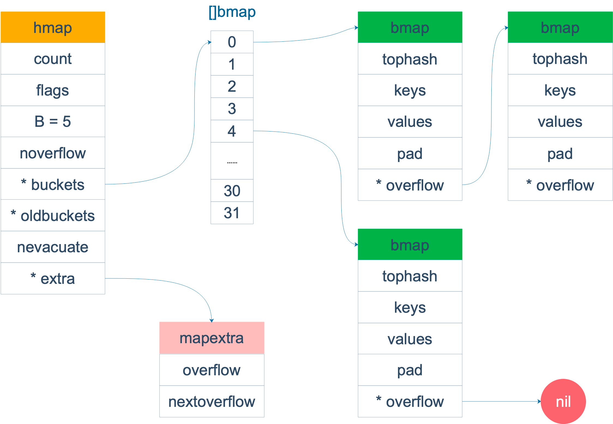
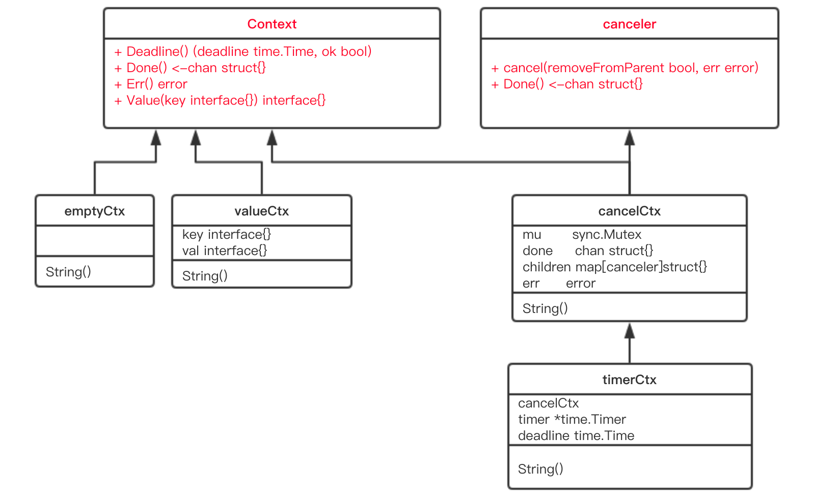

## go基础
### 数组与切片
- 对比
  - 数组为固定长度，不能修改，是一片连续的内存
  - 切片是一个结构体，含有三个字段(长度，容量，底层数组)
    - 底层数组是一个指针 `unsafe.Pointer`
    - len切片元素的数量，cap切片容量
- 切片扩容逻辑
  - 如果传入的cap大于doublecap，则直接使用传入的cap
    - `append([]int{}, 1,2,3,4,5)` 操作后，len=5, cap=6
  - v1.18之前
    - `old.cap < 1024` 2倍老容量 `newcap = doublecap`
    - `old.cap > 1024` 1.25倍老容量 `newcap = 1.25*old.cap`
  - v1.18之后
    - `old.cap < 256` 2倍老容量 `newcap = doublecap`
    - `old.cap > 256` `newcap = old.cap + (old.cap+3*256)/4`
  - 后面也会进行内存对齐操作
- 切片作为函数的参数
  - 当切片作为一个参数的时候，其实就像一个结构体作为函数的参数
  - 注意：
    - slice底层数据在数组上，slice存储的是一个指针
    - 传参的时候，尽快slice的数据没发生改变，也就是指针没变
    - 但是`s[i]=10`这种操作直接改变了数组的值，因此内容也发生了变化

### 哈希表

#### 哈希函数
- 分类
  - 加密类，md5、sha1、sha256
  - 非加密类，查找类
- 考察点
  - 性能
  - 碰撞概率
  
#### map的get的两种操作[编译器处理]
- mapaccess1 返回一个值
- mapaccess2 返回两个值

#### map为啥无序
- 扩容时，会发生key的搬迁
- 遍历会从一个随机的序号bucket开始，bucket对应的cell也是随机开始

#### 什么样的类型可以作为map的key
- 可比较的类型
- 除了slice、map、function等
- 注意
  - 引用类型的值，hash出来的值不一定相等
  - float类型作为key要注意的问题

#### 可以边遍历边删除吗？
- map不是一个数据安全的数据结构
  - 同一个协程内边读边写问题不大
  - 每次操作，会检测写标识，会直接panic
- sync.RWMutex
- 可以使用sync.map

#### 可以对map的元素取地址吗？
- 不可以，编译器不能通过
- 通过unsafe.Pointer等获取地址，不能长期持久，扩容会发生变动

#### map可以比较相等吗？
- 不可以，编译器不通过
- 深度相等条件
  - 都为nil
  - 非空，长度相等，指向同一个map实体对象
  - 相应的key,指向value深度相等

### 接口
#### go语言与鸭子类型的关系
- duck typing 定义
  - 动态语言的一种对象推测策略，它更关注对象能如何被使用，而不是对象的类型本身
- 通过interface实现
  - 不要求类型显示地声明实现了某个接口，只要实现了相关的方法即可，编译器就能检测到
  - 实际操作就是编译器在其中做了隐匿的转换工作

#### 值接受与指针接收有啥区别
- 区别
  - 值类型调用
    - 值方法，拷贝副本，类似"传值"
    - 指针方法，编译器会做处理，使用值的引用来调用，进行转换`(&qcrao).growup()`
  - 指针类型调用
    - 值方法，指针被解析为引用的值，也就是转成`(*stefno).hello()`
    - 实际是拷贝了一份指针，方法的操作会影响调用者。
- 总结
  - 如果实现了接收者是值类型的方法，会隐含的实现接收者是指针类型的方法
    - 如果接收者是指针类型的方法，编译器自动生产一个接收者是值类型的方法，这样在值类型的调用的时候，原本期望修改调用者的就没法实现
  - 修不修改对象本身不是由调用者对象类型(值、指针)来决定的，而是有方法的接收者决定的
- 使用场景
  - 使用指针接收者是的理由
    - 方法能够修改接收者指向的值
    - 避免每次调用方法时复制该值，大结构体更加高效

#### iface与eface的区别
- 动态类型(tab)
- 动态值(data)
- 如果打印出接口的动态类型和值
  - unsafe.Pointer

#### 编译器如何检测类型实现了某个接口
- 检测`*myWriter`是否实现了 `io.Writer`接口
  - `var _ io.Writer = (*myWriter)(nil)`
- 检测`myWriter`是否实现了`io.Writer`接口
  - `var _ io.Writer = myWriter{}`
- 总结
  - 上述赋值语句会发生隐式地类型转换，
  - 在转换的过程中，编译器会检测等号右边的类型是否实现了等号左边接口所规定的函数。

#### 类型转换与类型断言
- 本质
  - 把一个类型转换成另一个类型
- 类型转换
  - 前后两个类型要相互兼容才行
  - 语法：<结果类型> := <目标类型>(<表达式>)
- 类型断言
  - interface{}没有任何函数，go所有类型都实现了空接口
  - 当一个函数的形参是空接口时，需要对形参进行断言，从而得到它的真实类型
  - 语法：<目标类型值>, <布尔值> := <表达式>.(目标类型) // 安全类型断言
  - 不同之处：类型断言是对接口变量进行操作

#### 通过接口实现多态
- 多态特点(一种运行期的行为)
  - 一种类型具有多种类型的能力
  - 允许不同的对象对同一消息做出灵活的反应
  - 以一种通用的方式对待使用的对象
  - 非动态语言必须通过继承和接口的方式来实现

#### go语言编译快的原因
- 使用import的引用管理方式
- 更少的关键字，减少了编译器的复杂度
- 没有泛型，没有模版编译的负担
- 1.5版本之后的自举编译器优化

### 通道
#### 什么是CSP
- csp并发模型
  - 不要通过共享内存来通信，而是通过通信来实现内存共享
  - 通过 `goroutine` 和 `channel` 来实现
  - 提供一种线程安全的数据结构

#### 底层的数据结构是什么
- `hchan` 分析
  - 有一个环形数组buf，用来存放缓冲区的数据，配合`sendx`,`recvx`来控制环形队列
  - `sendq` 和 `recvq` 分别表示阻塞的goroutine, 这个goroutine表示正在读取channel或向channel发送数据被阻塞
  - 阻塞的链表为双向链表，而`sudog`是对goroutine的封装
  - makeChan() 返回的一个指针类型

#### channel的相关操作
- chanSend
- chanRecv
- closeChan
- makeChan

#### 如何优雅的关闭channel
- 不优雅的原因
  - 因为无法知道channel的状态，
  - 关闭一个已关闭的channel会报错，向一个已关闭的channel写数据也会报错
- 关闭channel的原则
  - 不要在receiver则关闭channel
  - 不要在多个sender时关闭channel
  - 原因：因为sender可以决定何时不发数据，并且关闭channel
- 不够优雅的方法
  - 使用`defer-recover`机制
  - 使用`sync.Once`只关闭一次
- 优雅的关闭方法
  - 分多种情况(sender、receiver的关系)
  - 中间channel+select配合模式来关闭

#### channel数据的发送与接收的本质
- "值的拷贝"

#### 什么情况会引起goroutine泄露
- goroutine操作channel后，处于发送或接收阻塞状态，channel处于满或空的状态一直得不到改变
- 对于一个channel，如果没有任何goroutine引用，gc会对其进行回收操作，不会引起内存泄露

#### 关于channel的happened-before有哪些？
- channel的状态
  - send(发送)
  - send finished(发送完成)
  - receive(接收)
  - receive finished(接收完成)
- happened-before的关系
  - 第n个 send 一定 happened before 第 n 个 receive finished，无论是缓冲型还是非缓冲型的 channel。
  - 对于容量为 m 的缓冲型 channel，第 n 个 receive 一定 happened before 第 n+m 个 send finished。
  - 对于非缓冲型的 channel，第 n 个 receive 一定 happened before 第 n 个 send finished。
  - channel close 一定 happened before receiver 得到通知。

#### channel的应用
- 停止信号
- 任务定时
  - 超时控制(select+time+channel)
  - 定时执行某个任务(time+select)
- 解耦生产者和消费者
- 并发控制(缓冲区channel)
  - 控制放在函数内部与外部有差异

### context
#### context是什么
- 主要用于goroutine传递上下文信息
  - 取消信号
  - 超时时间
  - 截止时间
  - k-v信息(并发安全的数据结构)

#### context.Value的值查找过程
- 理解 `valueCtx` 结构体
  - String() 方法
  - Value方法，实际就是一个递归查找的过程，一直向上查找
- 创建 `valueCtx`的方法
  - 函数签名 `WithValue(ctx Context, key, val interface{}) context`
- 总结
  - 递归查询的过程
  - 低效，覆盖问题
  - 建议不要使用context传值

#### context如何被取消

- `cancel()`方法实现的逻辑
  - 关闭channel, 也就是c.done
  - 递归的取消所有的子context, 也就是遍历`c.children` 然后执行`child.cancel()`
  - 从父节点上删除自己，调用`removeChild()`
- 创建可取消的context方法
  - `WithCancel(ctx Context) (ctx Context, cancel CancelFunc)`
- timerCtx
  - 基于cancelCtx 只是多了一个time.Timer和一个deadline
  - 创建方法
    - `WithTimeout(parent Context, timeout time.Duration)(Context, CancelFunc)`