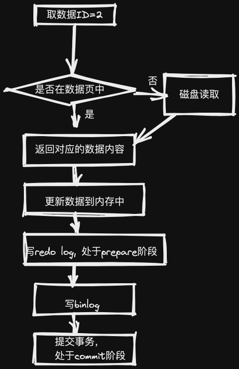

# mysql实战45讲

## 1. 基础篇
### 1.1 一条sql查询如何执行
[链接](https://excalidraw.com/#json=YAoxWVyLifjAHstRdNLLI,3shnK3oLNTjFO0r8oPaiGA)

#### 1.1.1 连接器
- tcp连接之后，在进行用户账号密码权限认证，通过之后在权限表中查出所有权限
- 之后这个连接里面的权限判断逻辑，都依赖此时读到的权限。(修改权限，原来的连接权限不变)
- 空闲连接啥时候被回收(show variables like '%wait_timeout%') 单位秒，默认8小时

**怎么解决长连接导致内存占用过大问题**  
- 定期断开连接
- 版本大于5.7可以通过 mysql_reset_connection() 初始化连接资源

#### 1.1.2 查询缓存
- 鸡肋产物，redis完美解决

#### 1.1.3 分析器
- 词法解析，语法解析

#### 1.1.4 优化器
- 多个索引时候，决定用哪一个
- 多表关联时，决定表的连接顺序
- 等等

#### 1.1.5 执行器
- 先要判断你对这个表有没有执行权限(表权限判断)
- 选择表对应的引擎提供的接口操作

### 1.2 一条sql更新是如何执行的
- 与查询基本差不多，需要失效所有的表相关的缓存
- 找到数据进行更新
- 设计重要的日志记录（重做日志，归档日志）

#### 1.2.1 重要的日志模块： redo log
- 是innodb引擎层的日志
- WAL(write ahead logging)技术
  - 磁盘顺序写比随机写快
  - 组提交机制可以大幅降低磁盘的IOPS消耗(fsync)
- 刷脏页策略如何控制
  - 定时刷
  - buffer pool不足
  - mysql 正常关闭
  - redo log满的时候

#### 1.2.2 重要的日志模块：binlog
- 为归档日志，在server层做记录，没有crash-safe能力
- 数据更新执行器流程

**思考？**
- 为什么有了redo log还需要binlog, 谈一下你对这两种日志的理解，以及它们的区别？
  - redo log 是innodb所有，binlog是所有的引擎所有，在sever层
  - redo log 是物理日志，记录某个数据页修改了什么，binlog是逻辑日志，记录语句的原始逻辑，比如"给ID=2的字段c加1"
  - redo log是循环写，空间固定会用完，binlog是追加写，不会覆盖以前的日志

#### 1.2.3 两阶段提交
- redo log分为两个阶段prepare和commit阶段，拆成两份的目的是为了保证两份日志之间逻辑一致
- 数据要做定期的备份

**思考**
- 怎么让数据库恢复到半个月内任意一秒状态？
  - 先找到最近的全量备份，将这个备份恢复到临时库
  - 从备份的开始时间算，将备份的binlog依次取出，重放到指定的时刻
  - 然后再把临时的数据库恢复到线上
- 日志为啥需要"二阶段提交"？(1 prepare阶段 2 写binlog 3 commit)
  - redo log与binlog提交的先后顺序都会导致日志数据的不一致
  - 当在2之前崩溃时, 重启恢复：后发现没有commit，回滚。备份恢复：没有binlog 。
  - 当在3之前崩溃 ,重启恢复：虽没有commit，但满足prepare和binlog完整，所以重启后会自动commit。备份：有binlog.
- 什么场景需要用到binlog和redo log来恢复数据?
  - 误操作恢复数据
  - 扩容恢复从库都会有问题 

### 1.3 事务隔离：为什么你改了我还看不到？
- 事务特性(ACID)
  - 原子性
  - 一致性
  - 隔离性
  - 持久性
- 多个事务同时执行可能出现的问题
  - 脏读(dirty read) (读到其他事务未提交的数据)
  - 不可重复读(non-repeatable read) (前后读取的记录内部不一致)
  - 幻读(phantom read) (前后读取的记录行数不一致)
- 隔离级别
  - 读未提交(read uncommitted)  (没有视图，直接返回最小行数据)
  - 读已提交(read committed) 视图(事务启动时创建)
  - 可重复读(repeatable read) 视图(在sql语句执行时创建) 事务在整个执行的过程中前后看到的数据是一致的
  - 串行化(serializable)   加锁
- 如何查看事务的隔离级别
  - show variables like 'transaction-isolation';
- RR级别的隔离如何解决幻读
  - 添加排他锁 for update
  - 使用可串行化(serializable)

#### 1.3.1 事务隔离级别的实现
- MVCC(多版本并发控制)
- undo log(回滚日志)

#### 1.3.2 事务的启动方式
- begin, start transaction
- rollback
- commit
- set autocommit=0 关闭自动提交事务，减少显示设置开启事务

#### 1.3.3 事务到底是隔离还是不隔离？
- begin/start transaction并不是事务的起点，一致性快照的起点
  - 一致性快照是在执行第一个快照读语句创建
  - 一致性快照是在执行start transaction with consistent snapshot
- 在mysql有"两个"视图的概念
  - 一个是view, 通过create view....
  - 一个是MVCC的一致性读视图，consistent read view，用在RC、RR隔离中实现
    -没有物理结构，用来定义事务执行期能看到什么数据

#### 1.3.4 快照在MVCC里是怎样工作的
- 快照是基于整库实现的，主要是一个数组（当前正在"活跃"的所有事物）的拷贝
- Innodb的每个事务都有一个唯一的ID,叫transaction id，是事务开始的时候申请的，按顺序严格递增
- 每行数据有多个版本，每次事务更新数据的时候都会生成一个新的版本，并且把transaction id 赋值给这个版本的数据，旧数据保留，新版本可以直接拿到这个版本数据
- 也就是数据表中的一行记录，其实可能有多个版本记录，每个版本记录有自己的row trx_id

**回滚日志（undo log）**
- 多版本并不是物理上真实存在的，而是通过undo log计算出来的
  - 比如需要V2版本的数据（需要通过v4版本依次执行U3、U2算出来）

**可重复读的隔离级别定义**
- 一个事务启动时，能够看到所有已提交的事务结果，但是之后，在执行期间，其实事务的更新对它不可见
- 事务执行之后，其他事务的更新对它虽然不可见，但是数据版本还是可见的，因为数据库实际上存储的是最新版本的数据。但是对于该事务来说，需要根据版本号以及Undo Logs计算出他需要的版本对应的数据

**思考**
- 回滚日志什么时候删除?
  - 系统中没有比回滚日志更早的日志就可以删除原因，因为read-view在commit之后就会被删掉
  - 没有事务再需要用到这个回滚日志，会被purge进程删掉
- 怎么看innodb中的长事务？对系统的危害有哪些？
  - information_schema.INNODB_TRX
  - 长事务的危害，导致undo log一直不回被删掉，导致大量的记录会被保留，占用额外的存储空间
  - 占用锁资源，拖垮数据库
- 如何避免系统的长事务？
  - 应用端思考
    - 开是否开启auto_commit, 开启general_log日志，去确定业务逻辑是否有问题
    - 确定是否有不必要的只读事务，把不必要的select从事务中去掉
    - 根据业务本身预估设置max_execution_time的最长时间，必须单条语句执行过长
  - 从数据库端思考
    - 监控information_schema.INNODB_TRX的表的数据，设置报警，超时kill动作
    - 利用pt-kill工具监控长事务
    - 保证undo log表空间足够

### 1.4 深入浅出索引
- 索引的目的是为了提高数据的查询效率

#### 1.4.1 索引常见的模型
- **hash表**，适合等值查询，不适合区间查询
- **有序数组**，等值查询与范围查询都很优秀，添加数据要移动数组，且空间有限
- **二叉搜索树**，
  - 为了维持O(log(N))的查询效率，需要维持这个数的平衡
  - 二叉搜索的效率高，但不用的原因主要是因为索引除了存在内存中外，还有可能在磁盘上，树太高，磁盘寻址太慢
  - 为了减少数据块的访问次数，因此我们就应该使用N叉树，这里的N取决于数据块的大小
  - N叉树的读写性能优点，以及适配磁盘的访问模式，非常适合数据库存储引擎
- **跳表(skiplist)**，增加向前指针的链表(多级索引)，随机化数据结构，可以进行二分查找的有序链表
- **LSM树**，使用顺序写代替随机写来提高性能，与此同时微弱降低读性能

#### 1.4.2 Innodb索引模型
- B+树索引模型
  - 每一个索引在Innodb里面对应一颗B+树
  - 索引类型分为主键索引(聚族索引)，非主键索引(二级索引)
- 主键索引与普通索引的查询有啥不同？
  - 非主键查询可能需要进行回表，索引覆盖之后就不用回表

#### 1.4.3 索引维护
- 维护索引数据的有序性
  - 在插入的时候需要进行维护，推荐使用自增主键，好处是每次插入数据追加，不必需要数据移动
  - 自增主键 not null primary key auto_increment
- 业务字段做主键问题
  - 逻辑的字段不容易保证数据的自增，这样写数据成本相对高一点
  - 如果字段大小控制不好，导致二级索引需要占用更多的额外空间
- **页分裂**
  - 页数据满，需要申请额外的页，移动部分数据，这个过程称为页分裂，会影响数据页的空间利用率
- **页合并**
  - 相连的两个页由于数据的删除，导致空间利用率很低，会进行页的合并

#### 1.4.4 经典范围查询如果做回表
- select * from t1 where k between 3 and 5
  - 先找k索引树上的3，通过Id进行回表
  - 再顺序访问k上的4，通过ID进行回表
  - 再顺序访问k上的5，通过ID进行回表
  - 最后访问k上的6，不满足条件退出循环。
- 如何避免回表查询
  - 覆盖索引，减少树的搜索，一种常见的优化手段
- 最左前缀原则
  - 联合索引是先根据第一个字段排序，如果第一个字段相同，再根据第二个字段排序
  - 创建联合索引要考虑索引字段的排序，尽量保证索引的复用能力
  - 如果(a,b)字段分开查询的频率都比较高，就要考虑字段的空间，来建立联合索引
- 索引下推
  - 仅能利用使用最左前缀原则，利用二级索引的值进行判断，减少回表查询
  
**思考？**
- 什么场景适合用业务字段来表示主键
  - 只有一个索引（这个就没有二级索引占用额外的空间）
  - 该索引必须是唯一索引（这样就不会重复）
- Innodb为什么要用B+树来进行索引
  - 更好配合的磁盘的读写特性，减少单次查询磁盘的访问次数
- 没有主键索引建普通索引，Innodb是如何进行查询
  - 如果删除，新建主键索引，会同时去修改普通索引对应的主键索引，性能消耗比较大。
  - 删除重建普通索引貌似影响不大，不过要注意在业务低谷期操作，避免影响业务。

### 1.5 全局锁和表锁
- 锁的目的
  - 处理多用户访问共享资源的并发问题
- 锁分类
  - 全局锁、表锁、行锁

#### 1.5.1 全局锁
- 对数据库整个实例加锁
  - flush tables with read lock (让数据库只读)
  - unlock tables (解除数据库的全局锁)
  - 应用场景，坐全库逻辑备份
- 官方的mysqldump对数据进行备份，如何保证数据的一致性
  - 导数据之前，会启用一个事务，来确保拿到数据的一致性视图
  - 为啥还需要FTWRL, 因为并不是所有的引擎都支持
- 为啥不使用set global readonly=true来设置只读
  - readonly有可能用到其他业务，比如主从
  - 客户端异常断开，FTWRL会释放锁，但是readonly不会，所以风险更高

#### 1.5.2 表级锁
- 分两种
  - 表锁
  - 元数据锁(meta data lock)MDL
- 表锁语法
  - lock tables ... read/write
  - write锁是排它锁，意味着其他线程不能读写
  - read锁是共享锁，意味着其他线程只读不写，本线程也只能读不能写
- MDL不显示使用
  - 一个访问就会自动加上，如果在查询的过程中，表结构数据发生变化，导致数据内容对不上，肯定不行
  - 在做增删改查的时候加上MDL读锁，在对表结构修改时加上写锁
  - MDL锁只有在事务提交的时候才释放，要小心防止锁住线上数据
- 如何给你查询频繁的表添加字段
  - 防止阻塞，添加等待时间，如果在规定的时间还没拿到锁就放弃，后面再重试
  - alter table t1 nowait/wait n add column

#### 1.5.3 行级锁
- 是有引擎自己实现了，并不是所有引擎都支持，MyiSAM就不支持行锁
- Innodb行锁的默认超时时间为 innodb_lock_wait_timeout设置为on

**二阶段锁**
- 行锁实在需要的时候加上的，但不是立马就释放，而是等到事务提交才释放
- 锁的添加与释放分为两个阶段，之间不允许交叉加锁和释放锁
- 如果你的事务可能要锁多行，就要把最有可能造成冲突的锁，影响并发度的锁放在后面

**Innodb死锁的产生，如何解决死锁问题**
- 由于两个事务之间资源循环依赖，涉及的线程都在等待别的线程资源释放，导致死锁的产生
- 两种策略解决死锁
  - 进入等待，一直到超时 innodb_lock_wait_timeout
  - 发起死锁检测，发现死锁，主动回滚死锁链条中的某一个事务，让其他事务能执行 innodb_deadlock_detect
- 死锁检测原理
  - 构建一个以事务为顶点、锁为边的有向图，判断有向图是否存在环，存在即有死锁
- 回滚原理
  - 选择插入更新或者删除的行数最少的事务回滚，于 INFORMATION_SCHEMA.INNODB_TRX 表中的 trx_weight 字段来判断。
  
**怎么解决热点数据更新导致的性能问题？**
- 关闭死锁检测（风险：大量超时）
- 做并发控制
- 优化业务逻辑