**[TOC]

# mysql实战45讲

## 基础篇

### 1.1 一条sql查询如何执行

#### 1.1.1 连接器
- tcp连接之后，在进行用户账号密码权限认证，通过之后在权限表中查出所有权限
- 之后这个连接里面的权限判断逻辑，都依赖此时读到的权限。(修改权限，原来的连接权限不变)
- 空闲连接啥时候被回收 `show variables like '%wait_timeout%'` 单位秒，默认8小时

**怎么解决长连接导致内存占用过大问题**  
- 定期断开连接
- 版本大于5.7可以通过 mysql_reset_connection() 初始化连接资源

#### 1.1.2 查询缓存
- 鸡肋产物，redis完美解决

#### 1.1.3 分析器
- 词法解析，语法解析

#### 1.1.4 优化器
- 多个索引时候，决定用哪一个
- 多表关联时，决定表的连接顺序
- 等等

#### 1.1.5 执行器
- 先要判断你对这个表有没有执行权限(表权限判断)
- 选择表对应的引擎提供的接口操作

### 1.2 一条sql更新是如何执行的
- 与查询基本差不多，需要失效所有的表相关的缓存
- 找到数据进行更新
- 设计重要的日志记录（重做日志，归档日志）

#### 1.2.1 重要的日志模块： redo log
- 是innodb引擎层的日志
- WAL(write ahead logging)技术
  - 磁盘顺序写比随机写快
  - 组提交机制可以大幅降低磁盘的IOPS消耗(fsync)
- 刷脏页策略如何控制
  - 定时刷
  - buffer pool不足
  - mysql 正常关闭
  - redo log满的时候

#### 1.2.2 重要的日志模块：binlog
- 为归档日志，在server层做记录，没有crash-safe能力
- 数据更新执行器流程  
- 

**思考？**
- 为什么有了redo log还需要binlog, 谈一下你对这两种日志的理解，以及它们的区别？
  - redo log 是innodb所有，binlog是所有的引擎所有，在sever层
  - redo log 是物理日志，记录某个数据页修改了什么，binlog是逻辑日志，记录语句的原始逻辑，比如"给ID=2的字段c加1"
  - redo log是循环写，空间固定会用完，binlog是追加写，不会覆盖以前的日志

#### 1.2.3 两阶段提交
- redo log分为两个阶段prepare和commit阶段，拆成两份的目的是为了保证两份日志之间逻辑一致
- 数据要做定期的备份

**思考**
- 怎么让数据库恢复到半个月内任意一秒状态？
  - 先找到最近的全量备份，将这个备份恢复到临时库
  - 从备份的开始时间算，将备份的binlog依次取出，重放到指定的时刻
  - 然后再把临时的数据库恢复到线上
- 日志为啥需要"二阶段提交"？(1 prepare阶段 2 写binlog 3 commit)
  - redo log与binlog提交的先后顺序都会导致日志数据的不一致
  - 当在2之前崩溃时, 重启恢复：后发现没有commit，回滚。备份恢复：没有binlog 。
  - 当在3之前崩溃 ,重启恢复：虽没有commit，但满足prepare和binlog完整，所以重启后会自动commit。备份：有binlog.
- 什么场景需要用到binlog和redo log来恢复数据?
  - 误操作恢复数据
  - 扩容恢复从库都会有问题 

### 1.3 事务隔离：为什么你改了我还看不到？
- 事务特性(ACID)
  - 原子性
  - 一致性
  - 隔离性
  - 持久性
- 多个事务同时执行可能出现的问题
  - 脏读(dirty read) (读到其他事务未提交的数据)
  - 不可重复读(non-repeatable read) (前后读取的记录内部不一致)
  - 幻读(phantom read) (前后读取的记录行数不一致)
- 隔离级别
  - 读未提交(read uncommitted)  (没有视图，直接返回最小行数据)
  - 读已提交(read committed) 视图(事务启动时创建)
  - 可重复读(repeatable read) 视图(在sql语句执行时创建) 事务在整个执行的过程中前后看到的数据是一致的
  - 串行化(serializable)   加锁
- 如何查看事务的隔离级别
  - `show variables like 'transaction-isolation';`
- RR级别的隔离如何解决幻读
  - `for update` 添加排他锁，当前读，也就是写锁
  - 使用可串行化(serializable)

#### 1.3.1 事务隔离级别的实现
- MVCC(多版本并发控制)
- undo log(回滚日志)

#### 1.3.2 事务的启动方式
- begin, start transaction
- rollback
- commit
- set autocommit=0 关闭自动提交事务，减少显示设置开启事务
- 修改事务的隔离级别
  - `set global transaction isolation level read committed;`
  - 或者通过修改配置

#### 1.3.3 事务到底是隔离还是不隔离？
- `begin/start transaction` 并不是事务的起点，一致性快照的起点
  - 一致性快照是在执行第一个快照读语句创建
  - 一致性快照是在执行`start transaction with consistent snapshot`
- 在mysql有"两个"视图的概念
  - 一个是view, 通过create view....
  - 一个是MVCC的一致性读视图，consistent read view，用在RC、RR隔离中实现
    -没有物理结构，用来定义事务执行期能看到什么数据

#### 1.3.4 快照在MVCC里是怎样工作的
- 快照是基于整库实现的，主要是一个数组（当前正在"活跃"的所有事物）的拷贝
- Innodb的每个事务都有一个唯一的ID,叫transaction id，是事务开始的时候申请的，按顺序严格递增
- 每行数据有多个版本，每次事务更新数据的时候都会生成一个新的版本，并且把transaction id 赋值给这个版本的数据，旧数据保留，新版本可以直接拿到这个版本数据
- 也就是数据表中的一行记录，其实可能有多个版本记录，每个版本记录有自己的row trx_id

**回滚日志（undo log）**
- 多版本并不是物理上真实存在的，而是通过undo log计算出来的
  - 比如需要V2版本的数据（需要通过v4版本依次执行U3、U2算出来）

**可重复读的隔离级别定义**
- 一个事务启动时，能够看到所有已提交的事务结果，但是之后，在执行期间，其实事务的更新对它不可见
- 事务执行之后，其他事务的更新对它虽然不可见，但是数据版本还是可见的，因为数据库实际上存储的是最新版本的数据。但是对于该事务来说，需要根据版本号以及Undo Logs计算出他需要的版本对应的数据

**事务的可重复读能力是怎么实现的？**
- 核心是一致性读（consistent read）
- 事务更新数据的时候只能用*当前读*
- 如果当前事物的行锁被其他事务占用的话，就需要进入锁等待

**读提交与可重复读的逻辑类似，主要区别**
- 可重复读隔离级别下，只需要在事务开始时候创建一致性视图，之后事务里的其他查询都共用这个一致性视图
- 在读提交的隔离级别下，每一条语句执行都会重新算出一个新的视图

**思考**
- 回滚日志什么时候删除?
  - 系统中没有比回滚日志更早的日志就可以删除原因，因为read-view在commit之后就会被删掉
  - 没有事务再需要用到这个回滚日志，会被purge进程删掉
- 怎么看innodb中的长事务？对系统的危害有哪些？
  - information_schema.INNODB_TRX
  - 长事务的危害，导致undo log一直不回被删掉，导致大量的记录会被保留，占用额外的存储空间
  - 占用锁资源，拖垮数据库
- 如何避免系统的长事务？
  - 应用端思考
    - 开是否开启auto_commit, 开启general_log日志，去确定业务逻辑是否有问题
    - 确定是否有不必要的只读事务，把不必要的select从事务中去掉
    - 根据业务本身预估设置max_execution_time的最长时间，必须单条语句执行过长
  - 从数据库端思考
    - 监控information_schema.INNODB_TRX的表的数据，设置报警，超时kill动作
    - 利用pt-kill工具监控长事务
    - 保证undo log表空间足够
- 为啥表结构没有可重复读？
  - 因为表结构没有对应的行数据，也没有row trx_id,因此只能遵循当前的读逻辑

### 1.4 深入浅出索引
- 索引的目的是为了提高数据的查询效率

#### 1.4.1 索引常见的模型
- **hash表**，适合等值查询，不适合区间查询
- **有序数组**，等值查询与范围查询都很优秀，添加数据要移动数组，且空间有限
- **二叉搜索树**，
  - 为了维持O(log(N))的查询效率，需要维持这个数的平衡
  - 二叉搜索的效率高，但不用的原因主要是因为索引除了存在内存中外，还有可能在磁盘上，树太高，磁盘寻址太慢
  - 为了减少数据块的访问次数，因此我们就应该使用N叉树，这里的N取决于数据块的大小
  - N叉树的读写性能优点，以及适配磁盘的访问模式，非常适合数据库存储引擎
- **跳表(skiplist)**，增加向前指针的链表(多级索引)，随机化数据结构，可以进行二分查找的有序链表
- **LSM树**，使用顺序写代替随机写来提高性能，与此同时微弱降低读性能

#### 1.4.2 Innodb索引模型
- B+树索引模型
  - 每一个索引在Innodb里面对应一颗B+树
  - 索引类型分为主键索引(聚族索引)，非主键索引(二级索引)
- 主键索引与普通索引的查询有啥不同？
  - 非主键查询可能需要进行回表，索引覆盖之后就不用回表

#### 1.4.3 索引维护
- 维护索引数据的有序性
  - 在插入的时候需要进行维护，推荐使用自增主键，好处是每次插入数据追加，不必需要数据移动
  - 自增主键 `not null primary key auto_increment`
- 业务字段做主键问题
  - 逻辑的字段不容易保证数据的自增，这样写数据成本相对高一点
  - 如果字段大小控制不好，导致二级索引需要占用更多的额外空间
- **页分裂**
  - 页数据满，需要申请额外的页，移动部分数据，这个过程称为页分裂，会影响数据页的空间利用率
- **页合并**
  - 相连的两个页由于数据的删除，导致空间利用率很低，会进行页的合并

#### 1.4.4 经典范围查询如果做回表
- `select * from t1 where k between 3 and 5`
  - 先找k索引树上的3，通过Id进行回表
  - 再顺序访问k上的4，通过ID进行回表
  - 再顺序访问k上的5，通过ID进行回表
  - 最后访问k上的6，不满足条件退出循环。
- 如何避免回表查询
  - 覆盖索引，减少树的搜索，一种常见的优化手段
- 最左前缀原则
  - 联合索引是先根据第一个字段排序，如果第一个字段相同，再根据第二个字段排序
  - 创建联合索引要考虑索引字段的排序，尽量保证索引的复用能力
  - 如果(a,b)字段分开查询的频率都比较高，就要考虑字段的空间，来建立联合索引
- 索引下推
  - 仅能利用使用最左前缀原则，利用二级索引的值进行判断，减少回表查询
  

**思考？**
- 什么场景适合用业务字段来表示主键
  - 只有一个索引（这个就没有二级索引占用额外的空间）
  - 该索引必须是唯一索引（这样就不会重复）
- Innodb为什么要用B+树来进行索引
  - 更好配合的磁盘的读写特性，减少单次查询磁盘的访问次数
- 没有主键索引建普通索引，Innodb是如何进行查询
  - 如果删除，新建主键索引，会同时去修改普通索引对应的主键索引，性能消耗比较大。
  - 删除重建普通索引貌似影响不大，不过要注意在业务低谷期操作，避免影响业务。

### 1.5 全局锁和表锁
- 锁的目的
  - 处理多用户访问共享资源的并发问题
- 锁分类
  - 全局锁、表锁、行锁

#### 1.5.1 全局锁
- 对数据库整个实例加锁
  - `flush tables with read lock` (让数据库只读)
  - `unlock tables` (解除数据库的全局锁)
  - 应用场景，坐全库逻辑备份
- 官方的mysqldump对数据进行备份，如何保证数据的一致性
  - 导数据之前，会启用一个事务，来确保拿到数据的一致性视图
  - 为啥还需要FTWRL, 因为并不是所有的引擎都支持
- 为啥不使用 `set global readonly=true` 来设置只读
  - readonly有可能用到其他业务，比如主从
  - 客户端异常断开，FTWRL会释放锁，但是readonly不会，所以风险更高

#### 1.5.2 表级锁
- 分两种
  - 表锁
  - 元数据锁(meta data lock)MDL
- 表锁语法
  - lock tables ... read/write
  - write锁是排它锁，意味着其他线程不能读写
  - read锁是共享锁，意味着其他线程只读不写，本线程也只能读不能写
- MDL不显示使用
  - 一个访问就会自动加上，如果在查询的过程中，表结构数据发生变化，导致数据内容对不上，肯定不行
  - 在做增删改查的时候加上MDL读锁，在对表结构修改时加上写锁
  - MDL锁只有在事务提交的时候才释放，要小心防止锁住线上数据
- 如何给你查询频繁的表添加字段
  - 防止阻塞，添加等待时间，如果在规定的时间还没拿到锁就放弃，后面再重试
  - `alter table t1 nowait/wait n add column`

#### 1.5.3 行级锁
- 是有引擎自己实现了，并不是所有引擎都支持，MyiSAM就不支持行锁
- Innodb行锁的默认超时时间为 innodb_lock_wait_timeout设置为on

**二阶段锁**
- 行锁实在需要的时候加上的，但不是立马就释放，而是等到事务提交才释放
- 锁的添加与释放分为两个阶段，之间不允许交叉加锁和释放锁
- 如果你的事务可能要锁多行，就要把最有可能造成冲突的锁，影响并发度的锁放在后面

**Innodb死锁的产生，如何解决死锁问题**
- 由于两个事务之间资源循环依赖，涉及的线程都在等待别的线程资源释放，导致死锁的产生
- 两种策略解决死锁
  - 进入等待，一直到超时 innodb_lock_wait_timeout
  - 发起死锁检测，发现死锁，主动回滚死锁链条中的某一个事务，让其他事务能执行 innodb_deadlock_detect
- 死锁检测原理
  - 构建一个以事务为顶点、锁为边的有向图，判断有向图是否存在环，存在即有死锁
- 回滚原理
  - 选择插入更新或者删除的行数最少的事务回滚，于 INFORMATION_SCHEMA.INNODB_TRX 表中的 trx_weight 字段来判断。
  

**怎么解决热点数据更新导致的性能问题？**
- 关闭死锁检测（风险：大量超时）
- 做并发控制
- 优化业务逻辑

## 2. 实战篇
### 2.1 普通索引与唯一索引的选择？
#### 2.1.1 查询过程
- 以如下语句进行优化
`select * from t where k = 5;`

**普通索引**
- 先通过普通索引k查找到满足k=5的记录，然后再去判断下一条记录是否满足k=5, 然后回表查询记录
- 由于innodb的最小单位是page, 默认大小为16kb, 所以下一条记录的判断绝大多的时候不需再次进行磁盘Io, 除非分页

**唯一索引**
- 由于唯一索引的唯一性，查询到唯一满足条件的时候就会停止检索，然后回表查询到对应记录
- 因为唯一索引比普通索引查询性能好一丢丢。理论上cpu的操作性能损耗应忽略

#### 2.1.2 change buffer(可以持久化数据)
- 当需要数据更新的时候
  - 如果数据在内存中，直接更新
  - 如果不在内存中，在不影响一致性的前提，更新操作会缓存再change buffer中，这样就不需要从磁盘中读取数据
- 在下次访问数据页的时候(merge操作)
  - 将数据缓存到内存中，然后执行change buffer中与这个页的操作，更新内存中的数据
- 什么情况下会触发merge操作(将change buffer的数据应用到原始数据页)
  - 读操作
  - 后台线程定期merge
  - 数据库的正常关闭
- change buffer主要为了解决什么问题
  - 减少读磁盘(随机读)
- 什么情况下可以使用change buffer?
  - 由于唯一索引必须判断这个k=4这条记录否是存在索引中，所以必须先将数据读入到内存中。因为唯一索引不能使用change buffer
  - 普通索引可以使用change buffer

#### 2.1.3 思考题？
- 某次写使用了change buffer机制，之后主机异常，是否会造成change buffer数据丢失？
  - 不会丢失
  - 虽然只更新内存，但在事务提交的时候，change buffer记录在redo log
  - 系统恢复会通过redo log恢复change buffer的数据
- merge的执行流程如何？会把数据写回磁盘？
  - 从磁盘中读入数据页到内存(老版本的数据页)
  - 从change buffer里找到这个数据页的change buffer记录(可能多条)，依次执行，得到新的数据页
  - 写入redo log, 这个redo log包含了数据的变更和change buffer记录的变更。
  - merge就执行完成了，因此merge不会写入磁盘，写入磁盘是脏页的刷新逻辑

### 2.2 mysql为什么会选错索引
#### 2.2.1 索引选择的工作原理
- 优化器选择索引的逻辑
  - 扫描的行数(扫描行数越少->访问磁盘越少->消耗cpu越少)
    - 根据统计信息估算记录数，也就是"区分度"，不同的值越多，区分度越高
    - 查看索引的基数 `show index from t4;` "cardinality"
    - 通过采样统计来确定
      - 默认选择N页，统计不同值，得到平均値，然后再乘以索引的页面数，这样就可以得到索引的基数
      - 当变更的数超过 1/M 页的时候，会触发重新做一次索引统计
    - 两种存储索引统计的方式，通过innodb_stats_persistent来设置
      - on 表示统计信息回持久化存储，默认N=20,M=10
      - off 表示统计信息只存储在内存中，默认N=8,M=16
  - 优化器还要考虑索引回表查询的代价
    - `analyze table t4` 可以用来重新统计索引信息
  - 是否使用临时表(内存不够，使用基于磁盘的临时表)
    - union查询
    - order by 与 group by的子句不一样时
    - distinct查询并加上order by时
    - 子查询
  - 是否进行排序
    - `explain select * from t4 where a between 1 and 1000 and b between 50000 and 100000 order by b limit 1;` 使用索引b, 而不是索引a
    - 因为使用索引a, 优化器会认为使用文件排序需要额外的消耗，所以选错索引

#### 2.2.2 索引选错异常处理
- 使用force index 强行选择索引
  - `explain select * from t4 force index(a) where a between 1 and 1000 and b between 50000 and 100000 order by b limit 1;`
  - 不够优美，变更索引名需要调整等问题
- 修改sql, 使其命中我们期望的索引
  - `explain select * from t4 where a between 1 and 1000 and b between 50000 and 100000 order by b,a limit 1;`
  - 调整 order by 使其选择任何一个索引都需要排序
  - `explain select * from  (select * from t4 where (a between 1 and 1000)  and (b between 50000 and 100000) order by b limit 100)alias limit 1;`
  - 诱导编译器选择索引b代价很高
- 新建更适合的索引，来提供给优化器做选择，或删掉误用的索引
  - 删掉不合适的索引
  - 建立联合索引避免回表查询等

### 2.3 怎么给字段添加索引
- 使用索引的原则
  - 区分度越高越好，因为高区分度，意味着复用的键值越少
- 索引创建的使用场景
  - 直接创建完整索引，要注意空间的占用情况
  - 前缀索引，节省空间，但会增加查询扫描次数，并且不能使用索引覆盖
  - 倒叙索引，可以解决前缀索引区分度不够问题，不支撑范围查询
  - hash索引，查询性能稳定，需要额外的存储和计算消耗，不支持范围查询

### 2.4 为什么我们的mysql会"抖"一下
#### 2.4.1 脏页的概念
- 脏页/干净页的理解
  - 当内存数据页跟磁盘数据页内容不一至的时候，我们称这个内存页为"脏页"
  - 内存数据写入磁盘后，内存和磁盘上的数据页的内容就一致，我们称"干净页"
  - 脏页与干净页都在内存中
- innodb在什么情况下，会触发刷脏(flush)过程？
  - redo log写满了(停止更新操作，checkpoint往前推进，redo log留出空间)
  - 系统内存不足，需要淘汰脏页
  - 系统空闲，触发刷脏
  - 系统正常关闭，触发刷脏

#### 2.4.2 刷脏对系统性能的影响
- 明显影响性能的情况？
  - redo log写满，更新全部堵住，写性能为零，对敏感性业务不能接受
  - 一个查询淘汰的脏页个数太多，会导致查询的响应时间明显变长
- 缓冲池中内存的三种状态
  - 没有使用
  - 使用了的干净页
  - 使用了的脏页
- 读取申请内存不够的淘汰策略
  - 先淘汰最久不使用的数据页从内存中淘汰
  - 如果是干净页直接释放复用，如果是脏页，必须先将脏页刷磁盘变成干净页之后再复用
  
#### 2.4.3 innodb刷脏的控制策略
- `show variables like '%innodb_io_capacity%'`
  - innodb_io_capacity表示磁盘的能力，建议设置成磁盘的iops
- innodb刷盘速度参考因素
  - 刷脏比例 `innodb_max_dirty_pages_pct` 默认75%
  - redo log写盘熟读
- 查看innodb的脏比
  - `select VARIABLE_VALUE into @a from performance_schema.global_status where VARIABLE_NAME = 'Innodb_buffer_pool_pages_dirty'; select VARIABLE_VALUE into @b from performance_schema.global_status where VARIABLE_NAME = 'Innodb_buffer_pool_pages_total'; select @a/@b;`
- innodb连刷机制
  - `show variables like '%innodb_flush_neighbors%';`
  - 会让查询抖动更大，现在磁盘io增大，建议关闭这个
- WAL技术
  - 将数据库的随机写转成顺序写，大大提升数据库性能

### 2.5 为什么表数据删除一半，表文件不变
#### 2.5.1 表结构的定义与数据存储
- mysql的innodb表包含部分
  - 表结构定义(8.0可以把表结构定义放在系统数据表中)
  - 数据
- innodb_file_per_table用来控制表数据存在共享表空间，也可以单独的文件
  - OFF表示，表数据放在系统共享表空间，也就是跟数据字典放一起
  - ON表示，每个Innodb表数据存储在一个.idb为后缀的文件（建议）
    - 独立在删除 drop table命令之后，系统可以直接删除文件，空间得到释放

#### 2.5.2 数据删除的执行流程
- 如果删掉一条记录R4
  - 会标记这个位置为删除，但磁盘文件的大小并不缩小
  - 如果后面插入的记录会在R4这个位置，会复用这个位置
- 如果删掉整个数据页上的所有记录
  - 这样整个数据页就可以被复用
  - 数据页复用跟记录复用不同，整个页复用可以存储到任何位置
- 相邻两个数据页利用率，页合并操作
  - 系统会将两个页的数据合并到一个也上，另外一个页就被标记为可复用
- 如果使用delete删除数据
  - 所有的页被标记为可复用，但磁盘上文件大小不变
  - 也就是说delete不会回收磁盘空间
  - 实际上不止删除数据会造成空洞，插入数据也会（随机的插入，就可能造成索引数据的分裂）

#### 2.5.3 如何解决磁盘不回收的问题？
- 重建表
  - `alter table A engine=Innodb`
  - mysql会自动完成转存数据，交换表名，删除旧表的操作
- 重建表的时候，往临时表插入数据，旧表又有数据写入如何解决？
  - mysql5.6 引入 online DDL
  - 建立一个临时文件，扫描表 A 主键的所有数据页；
  - 用数据页中表 A 的记录生成 B+ 树，存储到临时文件中；
  - 生成临时文件的过程中，将所有对 A 的操作记录在一个日志文件（row log）中，对应的是图中 state2 的状态；
  - 临时文件生成后，将日志文件中的操作应用到临时文件，得到一个逻辑数据上与表 A 相同的数据文件，对应的就是图中 state3 的状态；
  - 用临时文件替换表 A 的数据文件。
  - 由于日志文件的记录和重放操作功能的存在，在重建表的时候，允许对表A做增删改操作
  - 注意：会消耗IO和cpu资源
  
#### 2.5.4 online与inplace的区别
- tmp_table是由server创建的,`alter table t engine=innodb,ALGORITHM=copy;`
- tmp_file 是由innodb创建的，整个ddl都在innodb内部完成，是一种原地操作
- tmp_file `alter table t engine=innodb,ALGORITHM=inplace;`
- 给innodb添加全文索引字段过程
  - `alter table t add fulltext(file_name);`
  - 这个过程是inplace,但会阻塞增删改操作，非online
  - ddl过程如果是online, 则一点是inplace
  - 反之来未必，添加全文索引(fulltext index) 和 空间索引(spatial index)就属于这种情况

#### 2.5.5 optimize table / analyze table / alter table / truncate区别
- alter table 是recreate table操作
- analyze table 不是重建建表，只是对索引信息做重新的统计，没有修改数据，这个过程中加MDL读锁
- optimize table 等于 recreate + analyze
- truncate table 等于 drop + create

#### 2.5.6 思考题？
- 进行收缩表，结果占用空间更大
  - 本来很紧凑
  - 重新收缩，15/16整理数据，1/16留给update
  - 未整理之前的页已经占用了90%以上，收缩后，文件反而变大

### 2.7 count(*)这么慢，如何优化？
#### 2.7.1 count(*)实现方式
- innodb与myisam实现的原理
  - innodb 需要把数据一行一行地从引擎里面读出来，然后累积记数
  - Myisam引擎把表的总行数存在磁盘上
    - 每次直接返回，效率高，但这是没有过滤条件的count(*)
  - innodb引擎为什么不存储多少行数据，方便查询
    - 由于多版本并发控制(MVCC)的原因，Innodb也不知道返回多少行
    - 在事务的多个版本读取的行数不同
- innodb扫描行的优化
  - 扫描主键索引与其他索引一样，因此会选择扫描最小那棵树来遍历
  - 在保证逻辑正确的前提下，尽量减少扫描的数据量，是数据库系统设计的通用法则之一。
- `show table status` 的行数是估算出来的
  - 误差40%-50%
  - 不能直接替换扫描的行数

#### 2.7.2 经常使用count(*)如何优化
- 思路： 找一个地方，记录表的行数
  - redis缓存起来
    - 丢失，
    - 并发数据不精准，并发系统无法控制不同线程执行时刻
  - 找一个额外表存储起来
    - 解决丢失问题
    - 事务隔离的可视性问题

#### 2.7.3 不同的count逻辑不同问题
- count(*)、count(主键)、count(1)表示返回满足条件的结果集总行数
- count(字段)，表示满足条件，参数"字段"不为null的总个数
- 执行效率
  - count(字段)<count(主键id)<count(1)<count(*)
  - count(主键id)需要解析id, 然后判断null, 再累加
  - count(1) 不需要解析，只需判断行不为null，然后累积
  - count(*) mysql进行优化，认为一定非空，直接按行累积

#### 2.7.5 思考题？从并发性能来看，先插入操作记录还是先更新计数表
- 先插入记录，再更新计数统计表
- 更新统计表涉及到行数，先插入再更新能最大程度减少事务之间的锁等待，提高并发度

### 2.8 日志与索引的相关问题
- mysql修改操作redo log 与 binlog的二阶段提交[1.2.3]

#### 2.8.1 追问二阶段提交
- mysql怎么知道binlog是完整的
  - statement格式的binlog, 最后有一个commit
  - row格式的binlog, 最后会有一个xid event
- redo log 与 binlog是怎么串联起来的
  - 通过一个共同的字段 xid
  - 崩溃恢复的时候，会按顺序扫描redo log
  - 如果碰到有prepare、commit的redo log直接提交
  - 如果只有prepare, 没有commit的redo log, 会拿着xid去binlog找对应事务
- 处于 prepare 阶段的 redo log 加上完整 binlog，重启就能恢复，MySQL 为什么要这么设计?
  - 这个策略会 解决主从和备份数据的一致性问题，因为这些操作依赖binlog
  - 需要保证binlog的完整性
- 为什么需要二阶段提交？干脆先 redo log 写完，再写 binlog。崩溃恢复的时候，必须得两个日志都完整才可以。是不是一样的逻辑？
  - 二阶段提交是经典的分布式系统的问题
  - 如果直接写redo log, binlog失败，redo log又不能回滚，会造成数据的不一致性
- 只保留binlog可以吗？
  - 不能支持崩溃恢复
- 只有redo log可以吗？
  - 不可以，redo log是一个循环写，会覆盖原来的记录
  - 没办法起到归档作用
  - mysql系统的高可用就是binlog的复用
- redo log一般要设置多大？
  - 太小，很容易写满，不能不强刷redo log, wal技术发挥不出来
- 正常运行中的实例，数据写入后的最终落盘，是从 redo log 更新过来的还是从 buffer pool 更新过来的呢？
  - redo log并没有记录数据页的完整数据，没有能力更新数据磁盘页
  - 脏页的刷新跟redo log没有关系
  - 崩溃恢复的时候，脏页会丢失，会先将数据读到内存，然后用redo log更新为脏页
- redo log buffer 是什么？是先修改内存，还是先写 redo log 文件？
  - redo log buffer是一个内存，先保存redo日志
  - 真正的日志是redo log file(文件名ib_logfile+数字)，是在commit语句的时候做的
  - 事务在执行的过程中不会主动刷盘，用来减少io的消耗

#### 2.8.2 思考题，跟新一条相同的数据，mysql如何处理？
- InnoDB 认真执行了“把这个值修改成 (1,2)"这个操作，该加锁的加锁，该更新的更新。
- 主要是事务的隔离性

### 2.9 order by的工作原理
- 全字段排序
- rowid排序

#### 2.9.1 全字段排序
- `select name,city,age from t5 where city="hangzhou" order by name limit 100`的执行流程
  - 初始化sort_buffer,确定放入name,city,age这三个字段
  - 从索引city找到对应的主键id
  - 到主键id索引回表查询数据，取name,city,age三个字段，存储到sort_buffer
  - 重复执行索引city, 主键id回表查询
  - 对sort_buffer进行快速排序【可能在内存】
  - 按排序的结果取100行返回给客户端
- sort_buffer
  - sort_buffer【是mysql为每个线程分配一块内存用于排序】
  - 通过 `show variables like '%sort_buffer_size%';`
  - 如果排序的数据量太大，内存放不下，就会利用磁盘临时文件辅助排序
- 怎么判断排序是否使用了临时文件
  - number_of_tmp_files 超过需求排序的数据量的大小
  - sort_buffer_size 越小，需要分成的份数越多，number_of_tmp_files 的值就越大。

#### 2.9.2 rowid排序
- 单行数据很大，返回的数据量很大，一直使用临时文件，
- mysql对单行长度太大的优化
  - 初始化 sort_buffer，确定放入两个字段，即 name 和 id；
  - 从索引 city 找到第一个满足 city='杭州’条件的主键 id，也就是图中的 ID_X；
  - 到主键 id 索引取出整行，取 name、id 这两个字段，存入 sort_buffer 中；
  - 从索引 city 取下一个记录的主键 id；
  - 重复步骤 3、4 直到不满足 city='杭州’条件为止，也就是图中的 ID_Y；
  - 对 sort_buffer 中的数据按照字段 name 进行排序；
  - 遍历排序结果，取前 1000 行，并按照 id 的值回到原表中取出 city、name 和 age 三个字段返回给客户端。

#### 2.9.3 全字段排序 Vs rowid排序
- 选择原理
  - 如果内存足够大，会优先全字段排序，尽量减少磁盘io
  - 如果内存太小，会影响排序效率，才会采用rowid排序算法
  - 对innodb表来说，rowid排序会要求回表多造成磁盘读，因此不会优先选择

#### 2.9.4 如果减少文件排序
- 添加索引(联合索引)，将数据变成有序
- `alter table t5 add index city_name_age(city, name, age);` 联合索引，减少回表查询
- 分析 `using index` 表示使用了覆盖索引，减少了回表查询

#### 2.9.5 思考题
- `select * from t where city in ('杭州',"苏州") order by name limit 100;` 会有排序过程吗
  - 会
  - 杭州的name是排好序，苏州的name也是排好序，但是加起来就不满足排序
- 如果维护一个数据库端排序的方案，不需要额外排序
  - 分别查询，归并排序

### 2.10 如何正确显示随机消息
#### 2.10.1 order by rand() 排序随机取几条数据的背后逻辑
- `select word from words order by rand() limit 3` Using temporary(使用临时表); Using filesort(需要排序)
  - 创建临时表，使用memory引擎，会有两个字段，一个double(存随机数), varchar(存word单词)，表中没有建索引
  - 按主键取word值，调用rand()函数，将这两个值存在临时表中
  - 然后将没有索引的临时表按照随机数排序
  - 初始化sort_buffer, 将临时表的数据扫描添加到sort_buffer中，然后根据随机数排序
  - 排完序之后取前三条结果返回位置信息，这样就可以直接从内存中取出word值
  - `show variables like '%slow_query_log%';` 查看慢日志看扫描的行数

#### 2.10.2 mysql如何定位一行数据？
- 没有主键如何回表
  - 删掉主键，mysql会自己生成一个长度为6字节的rowid来作为主键
  - 排序过程中rowid的来历，标识数据行的信息
    - 没有主键，rowid是系统生成，有主键，rowid就是主键id
    - memory引擎不是索引组织表，可以认为是一个数组，rowid就是数组的下标
- 总结order by rand()
  - 使用了内存临时表
  - 内存临时表排序的时候使用了rowid排序方法

#### 2.10.3 磁盘临时表
- 什么时候会使用
  - 数据超过 tmp_table_size的限制，就会使用磁盘临时表， 默认16M
  - `show variables like '%tmp_table_size%';`
  - 磁盘临时表使用的引擎是innodb, 用`internal_tmp_dist_storage_engine`控制
  - 使用磁盘临时表就是一个没有显示索引的innodb表排序过程
- 为什么临时文件排序使用优先队列排序？而不是归并排序算法
  - 使用优先队列就可以只得到前3个，不需要排所有的
- 优先队列排序算法
  - 对于这 10000 个准备排序的 (R,rowid)，先取前三行，构造成一个堆；
  - 取下一个行 (R’,rowid’)，跟当前堆里面最大的 R 比较，如果 R’小于 R，把这个 (R,rowid) 从堆中去掉，换成 (R’,rowid’)；
  - 重复第 2 步，直到第 10000 个 (R’,rowid’) 完成比较。
  - 总是保证堆顶最大值

#### 2.10.4 如果优化随机排序算法？
- 思路1
  - 取得这个表的主键 id 的最大值 M 和最小值 N;
  - 用随机函数生成一个最大值到最小值之间的数 X = (M-N)*rand() + N;
  - 取不小于 X 的第一个 ID 的行。
  - 问题：空洞问题，会取不到值，概率不均衡
- 思路2
  - 取得整个表的行数，并记为 C
  - 取得 Y = floor(C * rand())。 floor 函数在这里的作用，就是取整数部分。
  - 再用 limit Y,1 取得一行。
  - 注意：mysql处理limit的做法就是按顺序一个一个读出来，丢掉前Y个，然后把一个记录作为返回结果，因此需要扫描y+c+1行，代价相对高一些
- 取三个值的随机算法
  - 取得整个表的行数，记为 C；
  - 根据相同的随机方法得到 Y1、Y2、Y3；
  - 再执行三个 limit Y, 1 语句得到三行数据。
- 思路3
  - `select * from words where id >= (select floor(rand()*(select max(id) from words))) order by id limit 10;`
  - 单词全部取出，使用redis缓存排序来处理业务，尽量不要让数据库做业务逻辑
  - 可以重建索引解决空洞问题

### 2.11 为什么mysql逻辑相同，性能差异这么大？
#### 2.11.1 条件字段函数操作
- `select count(*) from trade_log where month(t_modified)=7` t_modified上有索引
  - 不会走索引
  - `select * from words where id-1=999;` 索引失效

#### 2.11.2 隐式类型转换
- `select "10">9` 如果等于1,说明字符串转成了int, 否则int转成了字符串
- `explain select * from tradelog where tradeid=3423422` tradeid有索引且类型为varchar(32)
  - 会发生隐式类型转换，这样索引就会失效就会扫描全表
  - 对优化器执行的代码如下 `select * from tradelog where CAST(tradid AS signed int) = 110717;`
  - 也就是对索引字段操作，优化器会放弃走树搜索功能

#### 2.11.3 隐式字符编码转换
  - 关联表，一个是utf8, 一个是utf8mb4
  - `select * from trade_detail where tradeid=$L2.tradeid.value;`
    - 实际触发隐式转换 `select * from trade_detail  where CONVERT(traideid USING utf8mb4)=$L2.tradeid.value; `
    - 连接过程中要求在被驱动表的索引字段上加函数操作，直接导致全表查询
  - 如果解决字符串转换问题
    - 将表的字符集修改成相同

#### 2.11.4 另外慢查询场景
- 100万数据的表，有一个b字段，int(10), 其中等于1234567890的数据有10万条
  - `select * from t where b ="1234567890abcd";` 这个查询的执行流程，会走索引吗？
  - 在传给引擎执行的时候，做了字符截断。因为引擎里面这个行只定义了长度是 10，所以只截了前 10 个字节，就是’1234567890’进去做匹配；
  - 这样满足条件的数据有 10 万行；
  - 因为是 select *， 所以要做 10 万次回表；
  - 但是每次回表以后查出整行，到 server 层一判断，b 的值都不是’1234567890abcd’;
  - 返回结果是空。

#### 2.11.4 总结
- 对索引字段做函数操作，可能破坏索引值的有序性，因此优化器就决定放弃走树搜索功能
- 业务代码升级，执行explain是一个很好的习惯

### 2.12 为什么查一行语句，也执行这么慢？
#### 2.12.1 等到MDL锁
- 查询长时间不返回
  - `show processlist` 查看waiting for table metadata lock
  - 一个线程正在表t上请求或持有MDL写锁，把select语句堵住了

#### 2.12.2 等flush
- **flush表的动作**
  - `flush tables words with read lock;` 和 `flush tables with read lock;`
  - flush表动作->关闭已打开的表对象，同时将查询缓存中的结果清空（会等到所有正在运行的sql请求）
- 产生阻塞的流程
  - `select sleep(1) from words;` 默认要执行10万秒
  - `flush tables words` 需要关闭查询对象，就需要等待上一个结束，因此会阻塞
  - `select * from words where id =1` 也会被阻塞，被flush命令阻塞
  - `show processlist` 会出现 waiting for table flush

#### 2.12.3 等行锁
- 场景复现
  - session A `begin; update words set word="adad" where id =1;`
  - session B `select * from words where id=1 lock in share mode;`
  - session A启动事务，占用写锁，但未提交
  - session B查询需要获取读锁
- 如果解决
  - 找到对应的查询线程, 断开这个链接
  - 链接被断开的时候，会自动回滚这个连接里面正在执行的线程，也就释放了id=1的行锁
  - `show processlist; kill query processlist_id;`

#### 2.12.4 慢查询
- 没有索引，只是一条条扫描
  - `select * from t where c=50000 limit 1;`
  - 可以看慢查询扫描的行数
  - 坏查询不一定是慢查询，线上一般超过1ms都不是好查询
- 回滚日志太多，导致查询时间差的问题
  - session B 执行10万次 `update words set c=c+1 where id=1;`
  - session A `select * from words where id =1;` 会执行10次的回滚日志，所以比较耗时 
  - session A `select * from words where id =1 lock in share mode;`
  - `lock in share mode` 表示当前读，会直接读到结果不需要执行回滚日志

#### 2.12.5 总结
- 概念
  - 表锁
  - 行锁
  - 一致性读 `lock in share mode`
- 思考题？
  - `select * from t where c= 5 for update;` 会等待行锁释放之后，返回查询结果
  - `select * from t where c=5 for update nowait` 不等待，直接提示锁冲突，不返回结果
  - `select * from t where c=5 for update wait 5` 等待5秒，如果行锁仍未释放，则提示行锁冲突，不返回结果
  - `select * from t where c=5 for update skip locked` 直接返回结果，忽略行锁记录

### 2.13 幻读是什么？幻读有什么问题？
#### 2.13.1 幻读是什么？
- 一个事务在前后两次查询同一范围的时候，后一次查询看到前一次查询没有看到的行
  - 在rr级别下，普通查询时快照读，看不到别的事务插入的数据，因此，幻读在"当前读"才会出现
  - 修改不能称为幻读，幻读专指"新插入的行"

#### 2.13.2 幻读有什么问题？

#### 2.13.3 如何解决幻读？
- 间隙锁（Gap lock）只有在rr隔离级别下才生效
  - 产生幻读的原因是，行锁只能锁住行
  - 新插入记录这个动作，要更新的事记录之间的"间隙"
  - 锁的就是两个值之间的空隙
- `select * from t where d=5 for update`背后的逻辑
  - 不光锁住数据库已有的记录(n)个行锁
  - 还同时增加(n+1)个间隙锁，这样确保无法再插入新的记录
- 间隙锁和行锁合成 next-key lock
  - next-key lock 是一个前开后闭的区间
  - 间隙锁为开区间，next-key lock为前开后闭区间

#### 2.13.4 锁的冲突关系
- 读锁/写锁
  - 读锁与写锁冲突
  - 写锁与写锁冲突
  - 读锁与读锁不冲突
- 间隙锁(gap lock)
  - 间隙锁之间不存在冲突关系
  - 间隙锁与往这个间隙插入一个记录存在冲突关系

#### 2.13.5 思考
- rc模式，binlog_format=row组合为啥要这样用
  - row模式下保存的是每一行的前后记录，虽然占空间，但是不会因为保存命令而造成幻读
- 即使给所有的行加锁也解决不了幻读的影响
- 行锁确实比较直观，判断规则也相对简单，间隙锁的引入会影响系统的并发度，也增加了锁分析的复杂度

### 2.14 为什么我只改变一行，锁这么多？
#### 2.14.1 rr级别下，加锁的规则（两原则，两优化，一bug）
- 5.x-5.7.24, 8.0-8.0.13版本中的情况
  - 原则1: 加锁的基本单位是next-key lock, 是前开后闭区间
  - 原则2: 查找过程中访问到的对象才会加锁
  - 优化1: 索引上的等值查询，给唯一索引加锁时，next-key lock退化为行锁
  - 优化2: 索引上的等值查询，向右遍历时且最后一个值不满足等值条件的时候，next-key lock 退化为间隙锁
  - 一个bug: 唯一索引上的范围查询会访问到不满足条件的第一个值为止

#### 2.14.2 各种案例分析
- 等值查询间隙锁
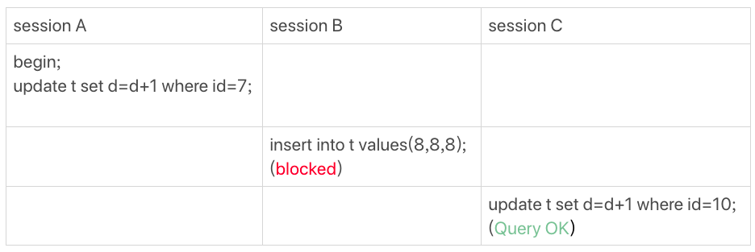

- 非唯一索引等值锁

- 主键索引范围锁
  

- 非唯一索引范围锁
  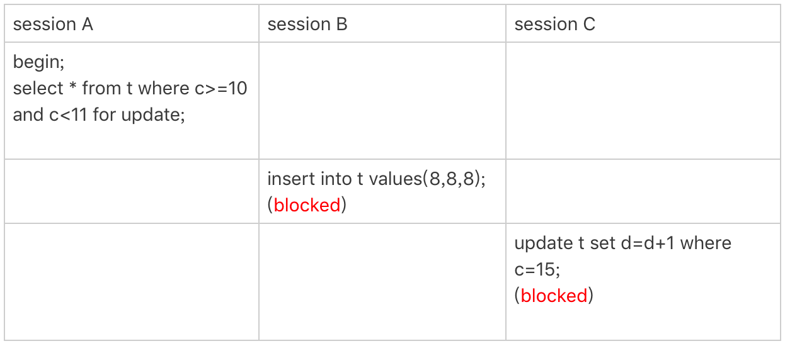

- 唯一索引范围锁bug
  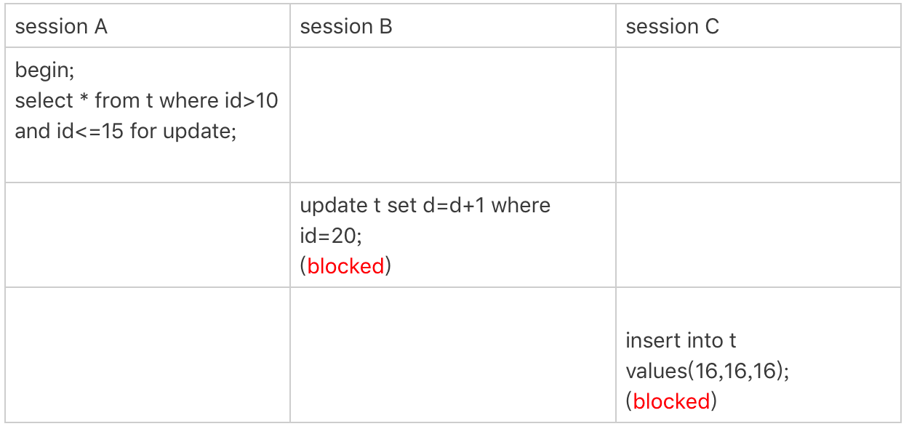

- 非唯一索引上存在"等值"的例子
 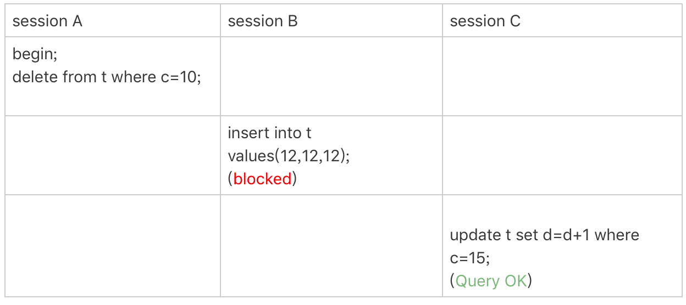

- limit语句加锁
  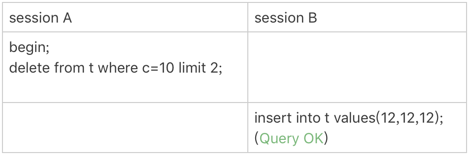

- 一个死锁的例子
  

### 2.15 mysql有哪些"饮鸩止渴"提高性能的方法？
#### 2.15.1 短连接风暴
- 短连接模型存在的风险
  - 一旦数据库处理的慢一些，连接数就会暴涨
  - 通过参数max_connections来查看最大的连接数
  - 查看现有的mysql连接 `select * from information_schema.processlist;`
  - `kill id;` 即可删掉连接
- 处理的方式
  - 第一种：先处理掉那些占着连接但是不工作的线程 `kill id`
  - 第二种：减少连接过程的消耗
    - 短时间大量的连接申请，跳过权限验证阶段, 重启加上参数 --skip-grant-tables
    - 开启--skip-grant-tables参数，mysql默认会开启skip-networking参数，只能被本地客户端连接

#### 2.15.2 慢查询的性能问题
- 索引没有设计好
  - 修改索引执行 alter table语句
  - 理解做法： 
    - 从库关闭 set sql_log_bin=off, 然后alter table添加索引
    - 切换主从设备
    - 在原来的主库执行set sql_log_bin=off, 修改alter table添加索引
- sql语句没有写好
  - `select * from t where id+1=1000;` 修改sql
- mysql选错索引
  - force index 强制指定索引
  
#### 2.15.3 如何提前发现索引没设计好和语句没有写好
- 测试环境开启慢sql, 设置 long_query_time=0, 确保每个语句记录都写到慢日志
- 测试表中模拟线上做回归测试
- 观察慢日志，留意rows_examined字段师傅与预期一致
- [慢日志分析工具](https://www.percona.com/doc/percona-toolkit/3.0/pt-query-digest.html)

#### 2.15.4 Qps突增问题
- 业务突然出现高峰，或者应用程序bug, 导致某个语句qps突然暴涨
  - 一种由全新业务的bug导致的，直接去掉这个功能
  - 如果新业务使用新的数据库，直接删掉账号，断开现有的连接
  - 如果这个功能跟现有的主体部署一起，只能通过处理语句来限制

### 2.16 mysql怎么保证数据不丢失
- 重要结论
  - 只要redo log和binlog保证持久化到磁盘，就能确保mysql异常重启后，数据可以恢复

#### 2.16.1 binlog的写入机制
- 写入逻辑
  - 事务执行中，先把日志写入到binlog cache, 
  - 事务提交的时候，将binlog cache写入到binlog磁盘文件中
  - 一个事务的binlog不能被拆分，无论事务多大，都要保证一次性写入
- binlog cache
  - 每个线程一片内存，`show variables like '%binlog_cache_size%'` 查看大小
  - 如果超过这个大小就要暂存到磁盘中
  - 事务提交将binlog cache写入文件中，会清空binlog cache的缓存

#### 2.16.2 binlog写盘分析

- 分析
  - 图中的 write，指的就是指把日志写入到文件系统的 page cache，并没有把数据持久化到磁盘，所以速度比较快。
  - 图中的 fsync，才是将数据持久化到磁盘的操作。一般情况下，我们认为 fsync 才占磁盘的 IOPS。
- write 和 fsync的时机，由参数 `show variables like '%sync_binlog%';` 控制
  - 0，表示每次提交事务都只write， 不fsync
  - 1，表示每次提交事务都会 fsync
  - N(n>1) 表示累积N个事务提交之后，才fsync
- 性能优化
  - sync_binlog设置一个比较大的值，可以提升性能，解决一定的io问题
  - 一般在100-1000之间
  - 对应的风险：如果主机异常重启，会丢失最近N个事务的binlog日志

#### 2.16.3 redo log的写入机制

- 三种状态分析
  - 存redo log buffer中，物理上再mysql进程内存中，是红色部分
  - 写到磁盘(write), 但没有持久化(fsync), 物理上是文件系统的page cache里面，是黄色部分
  - 持久化到磁盘，对应hard dist, 对应绿色部分
  - 写日志redo log buffer很快，write到page cache也差不多，持久化磁盘速度就慢很多
- 控制redo log 的写策略
  - `show variables like '%innodb_flush_log_at_trx_commint%';`
  - 0, 每次事务提交，只把redo log 写到redo log buffer
  - 1, 每次事务提交，都讲redo log 直接持久化到磁盘
  - 2, 表示每次事务提交时都只是把redo log 写到page cache
  - 注意：innodb有一个后台线程，每隔1秒，就会把redo log buffer中的日志，调用write写到文件系统重的page cache, 然后调用fsync持久化到磁盘
- 额外场景，将一个没有提交的事务redo log写入到磁盘
  - redo log buffer占用的空间即将达到 `show variables like '%innodb_log_buffer_size%';` 的一半时候，后台线程会主动写盘
  - 并行的事务提交的时候，顺带将这个事务的redo log buffer持久化到磁盘

#### 2.16.4 组提交机制(group commit)
- 目的
  - 减少IOPS消耗
  - 将多个事务的redo log一起写入到磁盘
- 参数控制
  - `show variables like '%binlog_group_commit_sync_delay%';` 表示延迟多少微妙之后才调用fsync
  - `show variables like '%binlog_group_commit_sync_no_delay_count` 表示积累多少次以后才调用
  - 两者是或关系，只要一个满足条件就是会调用fsync

#### 2.16.5 WAL机制
- 性能优化点
  - redo log 和 binlog 都是顺序写，磁盘的顺序写比随机写速度要快
  - 组提交机制，可以大幅度降低磁盘的IOPS消耗
- mysql性能IO上的优化
  - 修改组提交参数，减少binlog写盘次数, 增加响应时间
  - 修改`sync_binlog` 参数，多次才进行一次fsync，丢失binlog
  - 修改 `innodb_flush_log_at_trx_commit`参数，每次事务都不进行fsync, 丢失binlog

#### 2.16.6 思考题
- 执行update语句，使用`hexdump` 命令查看ibd文件内容，没有看到数据的改变
  - 有可能WAL机制，只保证了redo log, 内存，还没来得及同步到磁盘
- 为什么binlog cache事每个线程自己维护，redo log buffer是全局共用？
  - 设计原因，binlog是不能"被打断"，一个事务的binlog必须连续写，因此要整个事务完成后，再一起写到文件里
  - redo log并没有这个要求，中间生成的日志可以写到redo log buffer中
  - redo log中的内容还可以进行组提交，其他事务的内容，一起被写到磁盘
- 事务执行期间，还没到提交阶段，如果发生crash, redo log肯定丢了，这会不会导致主备不一致？
  - 不会，因为这时候binlog还在binlog cache里，还没发送给备库
  - crash以后，redo log 和binlog都没有，从业务的角度这个事务也没有提交，所以数据一致
- 如果binlog写盘以后发生crash, 这时候还没给客户端答复就重启了，等客户端再重连进来，发现事务已提交成功了，这是不是bug?
  - 不是
  - 实际上数据库crash-safe保证的是
    - 如果客户端收到实物成功的消息，事务就一定持久化
    - 如果客户端收到实物失败(主键冲突，回滚等)的消息，事务就一定失败
    - 如果客户端收到执行异常的消息，应用需要重连后通过查询当前状态来继续后续的逻辑，此时数据库只需要保证内部(数据和日志之间，主从之间)一致就可以了
- 你生产设置的"双1"吗？如果平时，你有什么场景改成过"非双1"吗？你的这种操作又基于决定？
  - 业务高峰期。有可预知的高峰期，DBA会有预案
  - 备库延迟为了让备库尽快赶上主库
  - 用备份护肤主库的副本
  - 批量导入数据
  - 注意：一般设置 `set innodb_flush_logs_at_trx_commit=2;` `set sync_binlog=2`

### 2.17 mysql怎么保证主备一致性？
#### 2.17.1 主备的基本原理
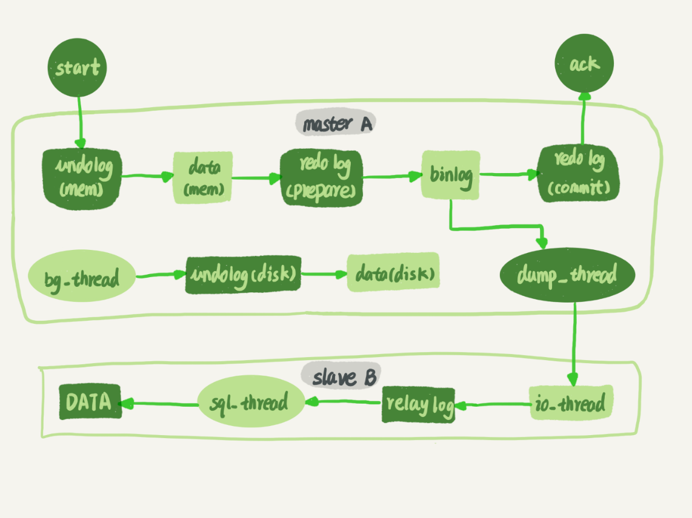
- 分析流程
  - 主库A内部有一个线程，专门用于服务备库B的这个长连接
  - 从库通过`change master`命令，设置主库IP、端口、账号、密码，以及从那个位置开始请求binlog(文件名，偏移量)
  - 从库执行`start slave`命令，会启动io_thread、sql_thread线程，其中io线程与主库建立连接
  - 主库校验账号密码之后，开始按照备库B传过来的位置，从本地读取binlog发送给B
  - 从库拿到binlog,写到本地文件，称为中转日志(relay log)
  - sql_thread读取中转日志，解析出日志里的命令，并执行， sql_thread是多线程

#### 2.17.2 binlog的三种格式对比
- `set binlog_format=statement;` 记录sql语句的原文
  - `mysql-> show binlog events in 'binlog.000001;`
  - `mysqlbinlog binlog.000001 --base64-output=decode-rows -v | more`
    - --base64-output 控制输出格式base64编码
    - decode-rows 把基于行的事件解码成一个sql语句
- `set binlog_format=row;` 记录真实操作的数据
  - 主备不会存在语义歧视，记录真正操作的主机id与数据
  - 缺点：删除10万数据，需要记录10万条记录到binlog中，消耗IO,影响执行速度
- `set binlog_format=mixed` 混合格式，两种都存在
  - mysql会自己判断这条数据会不会引起主备一致性，如果有可能，就会使用row格式，否则用statement
  - mixed即可利用statement格式的优点，同时避免了数据不执行的风险
  - 时间函数 now()是否会导致主从一致性的问题，如果是statement格式的话
- 如果解析binlog日志内容发生给mysql
  - `mysqlbinlog binlog.000001  --start-position=2738 --stop-position=2973 | mysql -h127.0.0.1 -P13000 -u$user -p$pwd;`

#### 2.17.3 循环复制问题

- 分析，节点A与节点B互为主从，切换时，binlog是否会被不断循环执行
  - 从节点 A 更新的事务，binlog 里面记的都是 A 的 server id；
  - 传到节点 B 执行一次以后，节点 B 生成的 binlog 的 server id 也是 A 的 server id；
  - 再传回给节点 A，A 判断到这个 server id 与自己的相同，就不会再处理这个日志。所以，死循环在这里就断掉了。

#### 2.17.4 思考mysql其他高可用方案
- 多节点
- 半同步
- Mysql group replication

### 2.18 mysql怎么保证高可用？
#### 2.18.1 主备延迟
- 延迟的可能情况
  - 运维动作(软件升级，主库所在机器按计划下线)
  - 主库所在机器掉电
- 如果查看主从延迟时间
  - 从库执行 `show slave status` 其中 seconds_behind_master 表示当前从库延迟了多少秒
  - seconds_behind_master的计算方法
    - 每个事务binlog里面都有一个时间字段，用于记录主库的写入时间
    - 备库取当前事务执行的时间字段，计算与系统的差，得到seconds_behind_master
    - 精度是秒
    - 不会受系统的时间不一致影响，会自动扣减系统的时间差

#### 2.18.2 主备延迟的来源
- 从库机器的性能要比主库所在的机器性能差
  - 多主一从(现在很少)，因为现在需要主从切换
- 备库压力大
  - 从库提供读能力，备运营使用，导致消耗大量cpu资源，影响主备延迟
  - 解决方案
    - 一主多从，分担读压力
    - binlog输出到外部系统，比如Hadoop, 让外部系统提供统计类查询能力
- 大事务
  - 主库必须等待事务执行完才会写入binlog, 再传给备库
  - 一次性删除太多的数据，典型的大事务
  - 大表的DDL， 也是大事务场景 
- 备库的并行复制能力

#### 2.18.3 主从切换的策略
- 可靠性优先策略
- 可用性优先策略

#### 2.18.4 可靠性优先策略
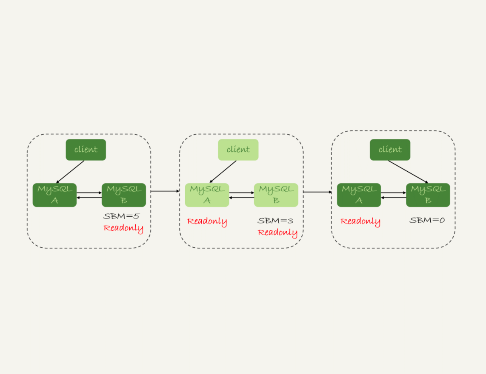
- 切换流程
  - 判断备库 B 现在的 seconds_behind_master，如果小于某个值（比如 5 秒）继续下一步，否则持续重试这一步；
  - 把主库 A 改成只读状态，即把 readonly 设置为 true；
  - 判断备库 B 的 seconds_behind_master 的值，直到这个值变成 0 为止；
  - 把备库 B 改成可读写状态，也就是把 readonly 设置为 false；
  - 把业务请求切到备库 B。
- 注意事项
  - 切换有不可用时间，中间过程系统都在readonly状态，表示系统不可写
  - 尽量保证seconds_behind_master值足够小

#### 2.18.5 可用性优先策略
- 代价：可能造成数据不一致性
- binlog_format=mixed的场景
  
  - 步骤 2 中，主库 A 执行完 insert 语句，插入了一行数据（4,4），之后开始进行主备切换。
  - 步骤 3 中，由于主备之间有 5 秒的延迟，所以备库 B 还没来得及应用“插入 c=4”这个中转日志，就开始接收客户端“插入 c=5”的命令。
  - 步骤 4 中，备库 B 插入了一行数据（4,5），并且把这个 binlog 发给主库 A。
  - 步骤 5 中，备库 B 执行“插入 c=4”这个中转日志，插入了一行数据（5,4）。而直接在备库 B 执行的“插入 c=5”这个语句，传到主库 A，就插入了一行新数据（5,5）。
- binlog_format=row的场景
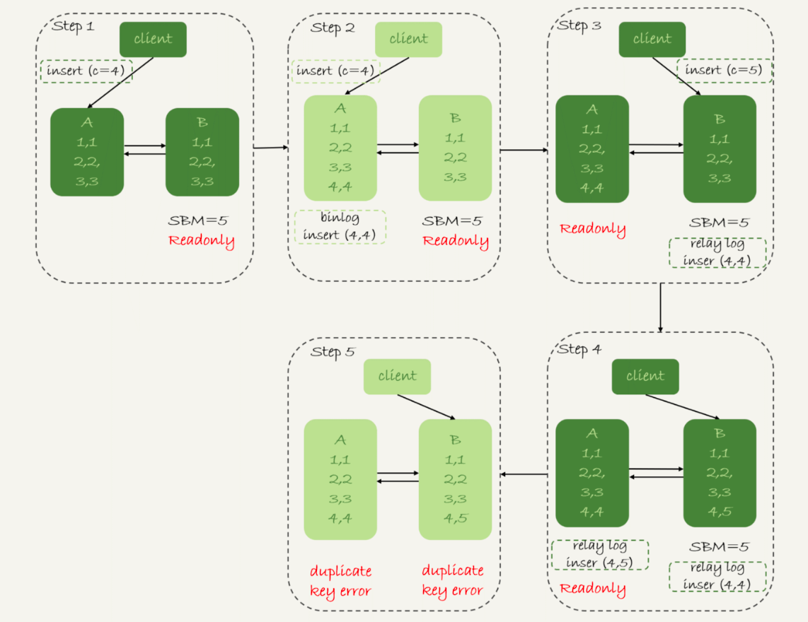
- 因为 row 格式在记录 binlog 的时候，会记录新插入的行的所有字段值，所以最后只会有一行不一致。而且，两边的主备同步的应用线程会报错 duplicate key error 并停止。也就是说，这种情况下，备库 B 的 (5,4) 和主库 A 的 (5,5) 这两行数据，都不会被对方执行。
- 结论
  - 使用 row 格式的 binlog 时，数据不一致的问题更容易被发现。而使用 mixed 或者 statement 格式的 binlog 时，数据很可能悄悄地就不一致了。如果你过了很久才发现数据不一致的问题，很可能这时的数据不一致已经不可查，或者连带造成了更多的数据逻辑不一致。
  - 主备切换的可用性优先策略会导致数据不一致。因此，大多数情况下，我都建议你使用可靠性优先策略。毕竟对数据服务来说的话，数据的可靠性一般还是要优于可用性的。
- 建议优先选择可靠性优先策略

#### 2.18.6 思考
- 运维系统
  - 做从库延迟监控 `show slave status` 采集 seconds_behind_master值

### 2.19 备库为啥延迟好几个小时？
#### 2.19.1 产生的原因
  - 如果备库执行日志的速度持续低于主库生成日志的速度，那么延迟可能是小时级别
  - 对于一个压力比较高的主库来说，备库很有可能永远也追不上主库

#### 2.19.2 并行复制模型

- worker数量如何控制
  - `show variables like '%slave_parallel_workers%';` 一般为机器的1/4-1/2核
- coordinator在分发任务应遵循的原则
  - 不能造成更新覆盖。也就是更新同一行的两个事务，必须背分派到同一个worker中
  - 同一个事物不能被拆分，必须放到同一个worker中

#### 2.19.3 并行复制的分发策略
- mysql5.6 
  - 按库并行
  - 优势：hash值很快，只需要库名，不要求binlog的格式
  - 缺点：主库的数据都放在同一DB,策略就会失效
- mariaDB的并行策略
  - 利用redo log的组提交优化
    - 在同一组提交的事务，一定不会修改同一行
    - 主库上可以并行执行的事务，备库也一定可以并行执行
  - 实现的流程
    - 在一组里面一起提交的事务，有一个相同的 commit_id，下一组就是 commit_id+1；
    - commit_id 直接写到 binlog 里面；
    - 传到备库应用的时候，相同 commit_id 的事务分发到多个 worker 执行；
    - 这一组全部执行完成后，coordinator 再去取下一批。
  - 存在的问题
    - 第二组事务开始之前，必须等待第一组事务完全执行完成后
- mysql5.7
  - `show variables like '%slave-parallel-type%';`
    - 配置DATABASE 表示按库并行
    - 配置LOGICAL_CLOCK, 类似mariaDB
    - 将commit表示锁的通过，其实在prepare已经通过
  - 并行的核心思想【针对前面的优化】
    - 时处于 prepare 状态的事务，在备库执行时是可以并行的；
    - 处于 prepare 状态的事务，与处于 commit 状态的事务之间，在备库执行时也是可以并行的。
- mysql5.7.22
  - commit_order
    - 根据同时进入 prepare 和 commit 来判断是否可以并行的策略。
  - writeset
    - 表示的是对于事务涉及更新的每一行，计算出这一行的 hash 值，组成集合 writeset。如果两个事务没有操作相同的行，也就是说它们的 writeset 没有交集，就可以并行。
  - writeset_session
    - 是在 WRITESET 的基础上多了一个约束，即在主库上同一个线程先后执行的两个事务，在备库执行的时候，要保证相同的先后顺序。

#### 2.19.4 思考题
- 主库单线程插入很多数据，过了3小时候，我们要搭建主库，为了尽快追上主库，要开并行复制，你如何选择策略
  - 查看策略
    - `show variables like '%binlog-transaction-dependency-tracking';`的策略 commit_order, writeset, writeset_session
  - 分析
    - 单线程不存在组提交，commit_order pass
    - 要保证单线程的执行顺序，writeset_session也pass
    - writeset 这种基于行的并行复制能力

### 2.20 主库出问题了，从库怎么办？
#### 2.20.1 一主多从技术架构

- 分析
  - 主备切换，也就是A点故障，主库切换成A'
  - 从库转移，执行 `change master命令`
  - `CHANGE MASTER TO MASTER_HOST=$host_name
    MASTER_PORT=$port
    MASTER_USER=$user_name
    MASTER_PASSWORD=$password
    MASTER_LOG_FILE=$master_log_name
    MASTER_LOG_POS=$master_log_pos  `
- 由于B是A的从库，本地记录的是A的位置，但相同的日志，A的位点和A'的位点不同，切换时，如果找到同步位点
  - 等待新主库A'把中转日志(relay log)全部同步完成
  - 在A'上执行`show master status`命令，得到当前A'最新的file和position
  - 取原主库A故障的时刻T
  - 用mysqlbinlog工具解析A'的file,得到T时刻的位点
- 主从切换时，遇到错误如何处理
  - 主动跳过一个事务
    - `set global sql_slave_skip_counter=1;`
    - `statrt slave;` 
  - 跳过制定的错误
    - `set slave_skip_errors=1032,1062`
    - 常见的两种错误
      - 1062 错误是插入数据时唯一键冲突；
      - 1032 错误是删除数据时找不到行。

#### 2.20.2 GTID
- 解析
  - 解决跳过事务和忽略错误达到最终一致性的复杂性
- 如果解决找到同步位点的问题
  - 设置全局事务ID(global transaction identifier), 在一个事务提交的时候生成，是这个事务的唯一标识
  - 格式
    - GTID=server_uuid:gno
    - server_uuid 是一个实例第一个启动时自动生成的，是一个全局唯一的值
    - gno是一个整数，初始值为1，每次提交事务时，加1
- gtid模式启动
  - 加上参数 gtid_mode=on 和 enforce_gtid_consistency=on
- gtid的两种生成方式
  - gtid_next=automatic 代表使用默认值
    - 记录binlog 先设置一行 set @@session.gtid_next='server_uuid:gno'
    - 把这个gtid加入本实例的gtid集合中
  - gtid_next='current_gtid'
    - 当current_gtid存在实例的集合中，接下来这个事务就会被系统忽略
    - 当current_gtid不存在实例集合中，就把这个gtid分配给当前的事务，不需要系统产生新的gtid, 因此gno也+1

#### 2.20.3 基于GTID的主备切换
- 执行命令
  - `CHANGE MASTER TO
    MASTER_HOST=$host_name
    MASTER_PORT=$port
    MASTER_USER=$user_name
    MASTER_PASSWORD=$password
    master_auto_position=1 `
  - 其中master_auto_position=1表示这个主备关系使用GTID协议
- 主从同步的逻辑 (set_a表示实例A'的GTID集合，set_b表示实例B的GTID集合)
  - 实例 B 指定主库 A’，基于主备协议建立连接。
  - 实例B把set_b发送给A'
  - 实例A'算出的set_a与set_b的差集，判断A'本地是否包含了这个差集需要的所有binlog事务
    - 如果不包含，表示A'已经把实例B需要的binlog给删掉，直接返回错误
    - 如果确认全部包含，A'从自己的binlog文件里面，找出第一个不在set_b的事务，发送给B
  - 之后就从这个事务开始，往后读文件，按顺序取binlog发送给B去执行
- 设计思想
  - 在基于GTID的主备关系，系统认为只要建立主备关系，就必须保证主库发给备库的日志是完整的
  - 也就是找位点的逻辑，在实例A'内部就已经自动完成，对HA系统开发人员说，非常友好

#### 2.20.4 思考题
- 在GTID模式下，从库执行`start slave`, 发现主库需要的binlog被删掉，导致主备创建不成功，应如果处理？
  - 如果业务允许主从不一致的情况，那么可以在主库上先执行 show global variables like ‘gtid_purged’，得到主库已经删除的 GTID 集合，假设是 gtid_purged1；然后先在从库上执行 reset master，再执行 set global gtid_purged =‘gtid_purged1’；最后执行 start slave，就会从主库现存的 binlog 开始同步。binlog 缺失的那一部分，数据在从库上就可能会有丢失，造成主从不一致。
  - 如果需要主从数据一致的话，最好还是通过重新搭建从库来做。
  - 如果有其他的从库保留有全量的 binlog 的话，可以把新的从库先接到这个保留了全量 binlog 的从库，追上日志以后，如果有需要，再接回主库。
  - 如果 binlog 有备份的情况，可以先在从库上应用缺失的 binlog，然后再执行 start slave。

### 2.21 读写分离有哪些坑？
#### 2.21.1 读写分离的架构特点
**客户端直连**

  - 架构简单，排查问题方便
  - 可以使用zookeeper组件来控制mysql链接问题，让后端专注业务

**proxy架构**
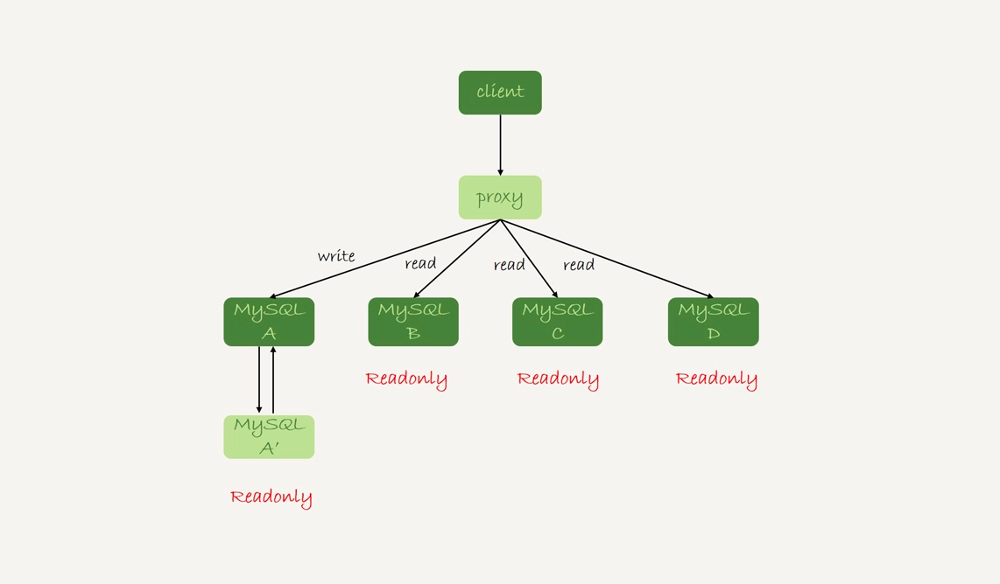
  - 对客户端比较友好，不需要关注后端细节，连接卫华，后端信息维护，都由proxy完成
  - proxy架构也需要高可用，带proxy架构比较复杂

#### 2.21.2 过期读(从库上读到过期状态)
- 主从延迟的解决方案
  - 强制走主库方案
  - sleep方案
  - 判断主备无延迟方案
  - 配合semi-sync方案
  - 等主库位点方案
  - 等GTID方案

#### 2.21.3 强制走主库方案
- 问题
  - 不好判断业务走主库还是从库，
  - 如果业务都不能是过期读，这样压力都会落到主库上

#### 2.21.4 sleep方案
- 问题
  - 用户体验不优化
  - 如果本来只需要0.5s就可以查到从库的正确数据，也要等1s
  - 超过1s的延迟，出出现过期读

#### 2.21.5 判断主备无延迟方案

- 第一种，先判断 `show slave status` 中 seconds_behind_master 是否已经等于0
  - 精度不够，单位秒
- 第二种，对比位点确保主备无延迟
  - master_log_file和read_master_log_pos 表示读到主库的最新位点
  - relay_master_log_file和exec_master_log_pos 表示备库执行的最新位点
- 第三种，对比GTID集合确保主备无延迟
  - auto_position=1, 表示主备关系使用GTID协议
  - Retrieved_Gtid_Set，从库收到的所有日志GTID集合
  - Executed_Gtid_Set, 备库所有已执行完成的GTID集合
  - 如果两个值相同，表示从库接收到日志都已完成同步
- 思考
  
  - 备库还没有收到日志的状态，出现过期读
    - trx1 和 trx2 已经传到从库，并且已经执行完成了；
    - trx3 在主库执行完成，并且已经回复给客户端，但是还没有传到从库中。

#### 2.21.6 配合semi-sync (半同步复制)
- 主要解决binlog发送同步的问题
- 设计思路
  - 事务提交的时候，主库把binlog发个从库
  - 从库收到binlog以后，发回给主库一个ack，表示收到了
  - 主库收到这个ack以后，才能给客户端返回"事务完成"的确认
- 一主多从同步的问题
  - 一主多从，只要等到一个从库的ack，就开始给客户端返回确认
    - 如果查询是落在这个响应ack的从库上，是能够确保读到最新数据
    - 但如果查询落到其他从库上，它们可能还没收到最新日志，就会产生过期读的问题
  - 业务高峰期，主库的位点或GTID集合更新很快，两个位点等值判断就会一直不成立，很有可能从库上迟迟无法响应查询请求的情况
    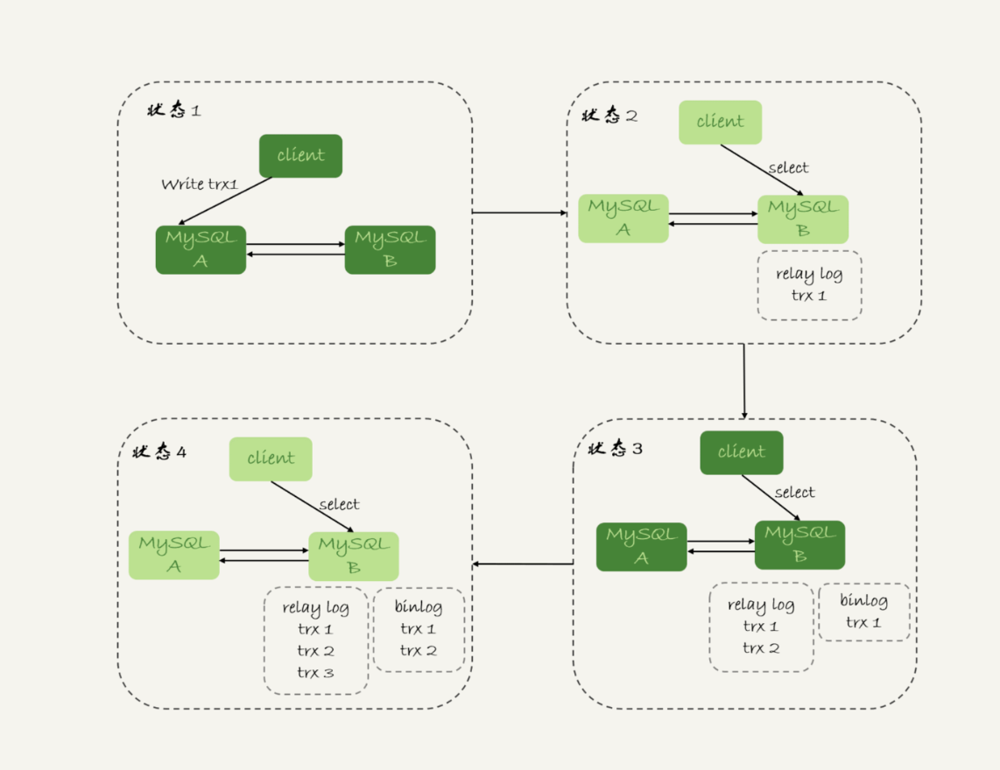

#### 2.21.7 等主库位点方案
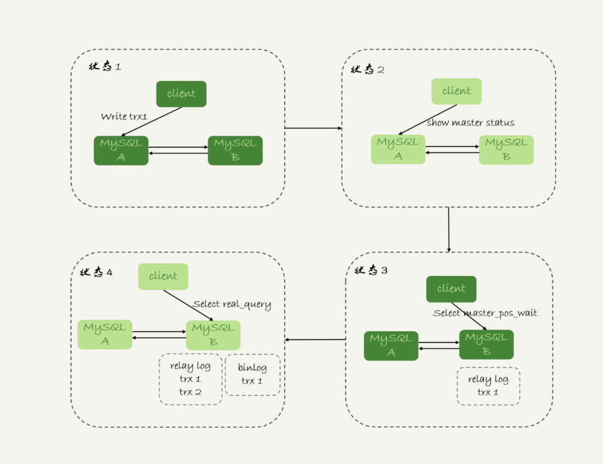
- 命令介绍
  - 从库执行 `select master_pos_wait(file, pos[, timeout]);`
  - 参数file 和pos指的是主库上文件名和位置
  - timeout可选，设为正整数N，表示函数最多等待N秒
    - 执行期间，备库同步线程发生异常，则返回null
    - 如果等待超过N秒，就返回-1
    - 如果刚开始执行的时候，发现已经执行过这个位置则返回0
- 具体执行流程
  - trx1 事务更新完成后，马上执行 `show master status` 得到当前主库执行到的 File 和 Position；
  - 选定一个从库执行查询语句；
  - 在从库上执行 `select master_pos_wait(File, Position, 1);`
  - 如果返回值是 >=0 的正整数，则在这个从库执行查询语句；
  - 否则，到主库执行查询语句。
- 不允许过期读的要求，需做好限流策略
  - 超时放弃
  - 转主库查询

#### 2.21.8 GTID等待方案

- 命令介绍
  - `select wait_for_executed_gtid_set(gtid_set, 1);`
  - 等待，知道这个库执行的事务中包含传入的gtid_set, 返回0
  - 超时返回1
- 执行流程
  - trx1 事务更新完成后，从返回包直接获取这个事务的 GTID，记为 gtid1；
    - 可以直接在事务完成后获得GTID, 在5.7.6之后的版本可以用这种方案
    - 可以通过 `show master status` 
  - 选定一个从库执行查询语句；
  - 在从库上执行 select wait_for_executed_gtid_set(gtid1, 1)；
  - 如果返回值是 0，则在这个从库执行查询语句；
  - 否则，到主库执行查询语句。
- 如果在更新完事务之后，让返回的包能取到这个事务的GTID?
  - `set session_track_gtids=OWN_GTID`
  - 通过Api接口 mysql_session_track_get_first从返回包解析出GTID的值

#### 2.21.9 思考题？
- 使用GTID等位点方案做读写分离，在对大表做DDL的时候会怎样？
  - 假设，这条语句在主库上要执行 10 分钟，提交后传到备库就要 10 分钟（典型的大事务）。那么，在主库 DDL 之后再提交的事务的 GTID，去备库查的时候，就会等 10 分钟才出现。
  - 这个读写分离机制在这 10 分钟之内都会超时，然后走主库。
  - 这种预期内的操作，应该在业务低峰期的时候，确保主库能够支持所有业务查询，然后把读请求都切到主库，再在主库上做 DDL。等备库延迟追上以后，再把读请求切回备库。

### 2.22 如果判断一个数据库是不是处问题了？**
#### 2.22.1 select 1判断
- 问题
  - 只能判断进程还在，并不能说明主库没有问题
  - 例子： `show variables like '%innodb_thread_concurrency%;` 
    - 表示innodb 只允许多少个进程同时执行， 如果为0，表示不限制并发线程数量
    - 如果大事务堵住了并发进程，这样也会出现阻塞问题
- 并发连接和并发查询
  - 并发连接 `show processlist` 查看并发连接，成本不大，只是多占内存
  - `innodb_thread_concurrency` 查看并发查询，cpu消耗比较高
- 锁等待与并发线程计数(也就是锁的等待不算并发线程)
  - 在线程进入锁等待以后，并发线程的计数器会减一
    - 锁等待cpu不会消耗cpu, 这样设计可以避免整个系统锁死

#### 2.22.2 查表判断
- 思路(解决`select 1`并发线程过多导致的问题)
  - 创建一个表，命名为 `health_check`, 只放一条数据
  - `select * from mysql.health.check` 定期执行
- 问题
  - binlog导致磁盘满的问题，没办法检测
  - 磁盘满，查询不受影响，更新就没办法处理
  
#### 2.22.3 更新判断
- 思路
  - `update mysql.health_check set t_modified=now();` 添加最后一次更新的时间
  - 解决磁盘满的问题
- 问题
  - 如果主库从库使用相同的命令，可能发生行冲突，导致主备同步停止
  - 因此mysql.check_health不能设计成只写一行数据，加一个`@@server_id`
- 更新判断慢的问题
  - 服务器IO资源分配的问题，如果IO资源打满
  - 外部检测在执行轮询时，存在随机性，如果第一次检测刚好系统正常的话，就需要下次检测才能发现问题

#### 2.22.4 内部统计
- 针对磁盘问题 `select * from performance_schema.file_summary_by_event_name` 表示每次IO统计的时间
  
  - 查看 event_name="wait/io/file/innodb/innodb_log_file" 这行的数据
  - 统计redo log写入时间，event_name表示统计的类型
  - count_star所有io的总次数
  - 后面的4项单位皮秒，表示，总和，最小值，最大值，平均值
  - 后面就是读操作统计，写操作统计
- 问题
  - 打开mysql自身的performance_schema统计会占用额外的性能
  - 全部打卡会占用10%的额外性能 

#### 2.22.5 思考题
- 业务系统一般也有HA需求，你开发和维护过的服务中，怎么判断服务有没有出问题？
  - 服务状态的监控，通过外部系统来实现
  - 服务质量架空，通过接口响应时间来统计
  - 按照监控对象
    - 基础监控
    - 服务监控
    - 业务监控

### 2.22 误删数据后除了跑路，还能怎么办？
#### 2.22.1 使用delete语句误删数据行
- flashback 实现
  - 修改binlog的内容，拿回原库重放
  - 前提是，需要确保binlog_format=row 和 binlog_row_image=FULL
- 具体操作
  - 对于insert语句，对应将binlog event类型是write_rows event 改成 Delete_rows event即可
  - 同理，对于delete语句，也是将Delete_rows event 改为 Write_rows event;
  - 而如果是Update_rows的话，binlog里面记录了数据行修改前和修改后的值，对调这两行的位置即可
- 数据恢复的正确做法
  - 恢复一个备份的库，在临时库上或者备份的库上操作，没有问题，再将确认过的临时数据恢复到主库
  - 有可能会产生二次破坏，因为线上的数据一直在变更
- 如果预防
  - `show variables like '%sql_safe_updates%;` 设置为on
  - 如果我们的delete或者update语句中写where条件，或者where条件没有包含索引，则报错
  - 上线的代码，需要经过sql审计

#### 2.22.2 误删表/库
- 思路
  - 定期的全量备份，实时备份的binlog
- 假如中午12点误删一个库，恢复数据的流程如下
  - 取最近一次全量备份，假设这个库一天一备，上次备份是当天0点
  - 用备份恢复出一个临时库
  - 从日志备份里面，取出凌晨0点之后的日志
  - 把这些日志，除了误删数据的语句外，全部应用到临时库
- 如何优化恢复的速度
  - mysqlbinlog 加上 -database 制定需要恢复的数据库，这样就只用重放制定的库就好了
  - 实例模式的不同
    - 非GTID模式，只能通过--stop-position参数跳过删除语句，然后再--start-position恢复开始语句
    - GTID模式，只需找到GTID号，然后执行`set gtid_next=gtid1;beign;commit;`
- 因为mysqlbinlog是单线程，且不能指定对应table如果处理
  - 并行复制(思考)

#### 2.22.3 预防误删库/表的方法
- 账号分离
  - 只给开发DML权限，不给truncate/drop权限
  - DBA团队成员，日常也只能使用只读账号，必要时才使用更新权限
- 制定操作规范
  - 删除数据表之前，必须先对表做改名操作，观察一段时间，无影响再执行删除操作
  - 改表名加固定的后缀(_to_be_deleted), 然后由管理系统执行

#### 2.22.4 rm删除数据
- HA系统
  - 不怕rm删除数据，只要不删除集群
  - 最后跨城市保存

#### 2.22.5 思考
- 分享一些误删除数据的处理经验
  - 直接拷贝文本去执行，sql语句被截断，导致数据库执行出错
  - 还可能存在乱码
- 四个脚本管理思路
  - 备份脚本
  - 执行脚本
  - 验证脚本
  - 回滚加班
- 保护文件的方案
  - 多做预防方案的设计讨论

### 2.23 为什么还有kill不掉的语句？
#### 2.23.1 命令操作
- kill query + 线程ID
  - 终止这个命令执行的语句
- kill connection + 线程ID (connection 可缺省)
  - 断开这个线程的连接
  - 如果这个连接有语句执行，先要停止正在执行的语句
- 现象思考？
  - kill命令之后，却没能断开这个连接，执行`show processlist` 发现连接还在，只是显示killed

#### 2.23.2 收到kill以后，线程做什么？
- 执行`kill query thread_id_B`, kill命令的线程做了两件事
  - 把session B的运行状态改成 THD::KILL_QUERY(将变量赋值为THD::KILL_QUERY)
  - 给session B的执行线程发一个信号
    - 因为session B处于锁等待状态，线程B并不知道这个状态变化，还是会继续等待
    - 发一个信号的目的，就是让Session B退出等待，来处理这个THD::KILL_QUERY状态
      - 一个语句执行中有多个埋点，用来判断语句终止逻辑
      - 处于等待状态，必须是一个可以被唤醒的等待，否则根本不会执行到埋点处
      - 语句从开始进入终止逻辑，到终止逻辑完全完成，是有一个过程的

#### 2.23.3 Kill无效的多种情况
- 线程没有执行到判断线程状态的逻辑
  - 还有IO过大，读写IO的函数一直无法返回，导致不能及时判断线程状态
- 终止逻辑耗时较长
  - `show processlist`上看Command=killed, 需要等到终止逻辑完成，语句才算真正完成
  - 超大事务执行期间被kill(数据版本回收耗时)
  - 大查询回滚
    - 临时文件，删除临时文件需要较大的IO
  - DDL命令执行到最后阶段
    - 删除临时文件需要较大的IO

#### 2.23.4 另外关于客户端的误解
- 如果库里面表特别多，连接就会很慢(指定表名的时候)
  - 建立连接只需要TCP握手，用户校验，获取权限，跟表无关
  - 慢的原因是做了额外的操作(`mysql -uu1 -pp1 db1)
    - 执行`show databases`
    - 切换db1,执行`show tables`
    - 把两个命令的结果用于构建一个本地的哈希表(表多比较耗时)

#### 2.23.5 思考题
- 如果你碰到一个被 killed 的事务一直处于回滚状态，你认为是应该直接把 MySQL 进程强行重启，还是应该让它自己执行完成呢？为什么呢？
  - 等
  - 因为重启之后回滚动作还是得执行，从恢复的角度来说，应该让它自己结束
  - 特殊情况
    - 如果占用别的锁，或占用IO资源过多，从而影响到别的语句执行的话，就需要先做主备切换，切换到新主库提供服务
    - 切换后的线程断开连接，自动停止执行

### 2.24 我查这么多数据，会不会把内存打爆？
#### 2.24.1 全表扫描对server层的影响
- mysql是边读边发的取数据和发数据流程
  - 获取一行，写到 net_buffer 中。这块内存的大小是由参数 net_buffer_length 定义的，默认是 16k。
  - 重复获取行，直到 net_buffer 写满，调用网络接口发出去。
  - 如果发送成功，就清空 net_buffer，然后继续取下一行，并写入 net_buffer。
  - 如果发送函数返回 EAGAIN 或 WSAEWOULDBLOCK，就表示本地网络栈（socket send buffer）写满了，进入等待。直到网络栈重新可写，再继续发送。
- 如果接收数据的客户端网络阻塞
  - `show processlist` 看服务端，发现state一直处理"sending to client"状态
  - 对于正常的线上业务来说，如果一个查询的返回结果不会很多的话，我都建议你使用 mysql_store_result 这个接口，直接把查询结果保存到本地内存。

#### 2.24.2 全表扫描对innodb的影响
- buffer pool 可以起到加速更新，还有加速查询
  - 内存命中率 `buffer pool hit rate` 
  - 内存管理淘汰算法（LRU）,链表实现
    - 需要结局大查询淘汰大量页的问题

#### 2.24.1 总结
- server端：mysql采用边算编发的逻辑，因此对于数据很大的查询来说
- 引擎内部：由于淘汰策略，LRU算法改进，冷数据的全表扫描，对buffer pool的影响也能做到可控

### 2.25 到底可不可以使用join
#### 2.25.1 Index Nested-Loop Join(NLJ) `可以使用被驱动表的索引`

- 执行流程
  - 对驱动表t1做全表扫描
  - 对每一行R, 根据a字段去表t2查找，走索引树搜索
  - 对t1表的结果在t2表中一一搜索，然后合并结果返回
- 怎么选择驱动表
  - 驱动表走全表扫描，而被驱动的表走树索引
  - 因此需要选择较小的表为驱动表
- 总结
  - 使用join语句，性能比单表执行sql语句性能好
  - 使用join语句，需要让小表做驱动表

#### 2.25.2 Block Nested-Loop Join(BNL) `被驱动的表上没有可用的索引`

- 执行流程
  - 把t1表的数据读入线程内存join_buffer中
  - 扫描t2,把表t2中的每一行取出来，跟join_buffer中的数据对比，满足join条件的，作为结果集返回
- 性能提升点
  - 由于数据加入到内存中，判断的速度更快
- 怎么选择驱动表
  - 两个表都会进行一次全表扫描M+N
  - 内存中的判断次数M*N
  - 因此大表还是小表做驱动表，执行耗时一样
- join_buffer内存大小如何控制
  - `join_buffer_size` 默认256k
  - 如果表中的数据放不下，就会使用分段放
- 优化
  - 调节`join_buffer_size`大小，可以改善语句响应速度

#### 2.25.3 总结
- 能不能使用join语句
  - 如果使用index Nested-Loop Join算法，可以使用
  - 如果使用Block Nested-Loop Join算法，尽量不要使用
  - 通过explain分析，Extra字段是否出现 `Block Nested Loop`
- 如果使用join,选择大表还是小表做驱动表？
  - Index Nested-Loop 应该使用小表
  - Block Nested-Loop
    - 如果join_buffer_size足够大，是一样的
    - 如果join_buffer_size不够，应选择小表
- 小表的定义？
  - 表按照各自的条件过滤，过滤完之后，计算参与join的各个字段的总数据量，数量小的那个表，就是"小表"，应该作为驱动表

#### 2.25.4 思考题？
- Block Nested-Loop算法，被驱动表示大表，并且是冷数据，除了IO压力之外，还有什么影响？
  - Buffer Pool命中率降低
  - M*N的判断，会占用CPU资源
  - 多次扫描被驱动表，占用磁盘IO

### 2.26 join语句怎么优化？
#### 2.26.1 Multi-Range Read优化
- 目的
  - 尽量使用顺序读盘
- 设计思路
  - 大多数数据都是按主键递增顺序插入得到的
  - 按照主键递增顺序查询的话，对磁盘的读比较接近顺序读，能够提升读性能
- 执行流程
  - 索引a，定位到满足条件的记录，将Id值放入read_rnd_buffer中
  - 将read_rnd_buffer中的id进行递增排序
  - 排序的id数组，依次到主键id索引记录中查记录，并作为结果返回

#### 2.26.2 Batched Key Access(BKA) `主要是对NLJ算法的优化`
- 操作
  - 被驱动表上建索引，将BNL转换成BKA
  - 可以考虑使用临时表，然后给临时表加索引，再join操作

#### 2.26.3 hash join
- mysql官方不支持
- 用来解决mysql这种M*N的判断操作
- 整个过程要比临时表方案执行效率高

### 2.27 为什么临时表可以重名？
#### 2.27.1 临时表的特性
- 主要特点
  - `create temporary table...` 可以选择多种存储引擎
  - 只能被自己创建的线程可见
  - 临时表与普通表可以重名，访问优先级是临时表>普通表
  - show tables命令不显示临时表
  - session结束之后，临时表会自动删除
- 临时表适合join优化的场景
  - 不同的session可以重名，不用担心表名重复导致建表失败的问题
  - 不用担心数据删除问题

#### 2.27.2 临时表的应用
- 优化复杂查询
- 分库分表系统跨库查询

  - 在proxy层进程代码实现排序
    - 需要开发工作量比较大
    - 对proxy端压力比较大
  - 把各个分库拿到的数据，汇总到一个mysql实例
    - 建立临时表
    - 各个分库上执行，将分库的结果插入到临时表
    - 执行

#### 2.27.3 为啥临时表可以重名？
- 存放位置
  - `select @@tmpdir` 或 `show variables like '%tmpdir%';`
  - 普通表名 table_def_key 由 "库名+表名" 得到
  - 临时表 table_def_key 由 "库名+表名+server_id+thread_id"
  - 每个线程都维护了自己的临时表链表，每次操作先遍历临时表，再操作普通表

### 2.28 什么时候使用内部临时表？
#### 2.28.1 union执行流程
`select id%10 as m, count(*) as c from t1 group by m;`

- 执行流程
  - 创建内存临时表，表里有两个字段 m 和 c，主键是 m；
  - 扫描表 t1 的索引 a，依次取出叶子节点上的 id 值，计算 id%10 的结果，记为 x；
    - 如果临时表中没有主键为 x 的行，就插入一个记录 (x,1);
    - 如果表中有主键为 x 的行，就将 x 这一行的 c 值加 1；
  - 遍历完成后，再根据字段 m 做排序，得到结果集返回给客户端。
  
#### 2.28.2 group by 执行流程
- 几种算法
  - 如果对 group by 语句的结果没有排序要求，要在语句后面加 order by null；
  - 尽量让 group by 过程用上表的索引，确认方法是 explain 结果里没有 Using temporary 和 Using filesort；
  - 如果 group by 需要统计的数据量不大，尽量只使用内存临时表；也可以通过适当调大 tmp_table_size 参数，来避免用到磁盘临时表；
  - 如果数据量实在太大，使用 SQL_BIG_RESULT 这个提示，来告诉优化器直接使用排序算法得到 group by 的结果。
  
#### 2.28.3 group by优化方案
- 索引
- 直接排序

#### 2.28.4 总结
- 如果语句执行过程可以一边读数据，一边直接得到结果，是不需要额外内存的，否则就需要额外的内存，来保存中间结果；
- join_buffer 是无序数组，sort_buffer 是有序数组，临时表是二维表结构；
- 如果执行逻辑需要用到二维表特性，就会优先考虑使用临时表。比如我们的例子中，union 需要用到唯一索引约束， group by 还需要用到另外一个字段来存累积计数。

### 2.29 都说Innodb好，那还要不要使用memory引擎？
#### 2.29.1 Innodb与memory数组的组织方式
- Innodb
  - 把数据放在主键索引上，其他索引上保存的是主键Id
  - 索引组织表(index organized table)
- Memory
  - 采用的是把数据单独存放，索引上存储的是数据位置的组织形式
  - 堆组织表(heap Organized table)
- 特点
  - innodb数据总是有序存放，而内存表的数据是按写入顺序存放的
  - 数据空洞，innodb为了保证数据的有序性，只能在固定的位置写入新值，而内存表找到空位就可以插入
  - 数据发生变化，innodb只需要修改主键索引，memory需要修改所以的索引位置
  - innodb主键查询只走一次索引，普通索引查询需要走两次索引查找，而内存表所有的索引地位相等
  - Innodb支持变长数据类型，不同记录长度可能不同，内存表不存在blob,text字段，因此内存表的每行数据长度相等

#### 2.29.2 hash索引与B+树索引
- 生产环境不建议使用内存表的原因
  - 锁粒度问题
  - 数据持久性问题
- 注意
  - 内存表也支持B+树索引

#### 2.29.3 内存表的锁
- 内存表不支持行锁，只支持表锁
  - 一张表只有有更新就会堵住其他在这张表的所有读写操作
  - 与MDL锁不同，但都是表锁级别

#### 2.29.4 数据持久性问题
- m-s架构问题
  - 备库重启，内存表数据被清空，这样主库的binlog同步就会报错
- 建议把内存表换成InnoDB表来代替

### 2.30 主键自增不连续的三种原因？
#### 2.30.1 唯一键冲突导致自增主键id不连续
- 主键自增值保存在哪里
  - Myisam引擎，保存在数据文件中
  - Innodb引擎保存在内存中
    - 8.0版本之后，才有了持久化能力，发生重启，可以恢复到重启前的值
    - 以前的版本，每次重启之后，就需要重新查询max(id)再进行恢复
    
#### 2.30.2 事务回滚导致自增主键不连续
- 事务回滚，自增值为什么不回退
  - 目的为了提升性能
  - 解决主键冲突
- 自增锁的优化
  - 自增Id锁并不是一个事务锁，而是每次申请完就马上释放，以便允许别的事务再申请
  - `show variables like '%innodb_autoinc_lock_mode%'` 控制自增id锁，默认为1
    - 0表示语句执行结束后才释放锁
    - 1时对于普通的insert,自增锁申请完之后马上释放，对应`insert...select`批量插入数据要等结束后才被释放
    - 2表示申请自增主键的动作都是申请后就释放
    
#### 2.30.3 自增主键的批量申请
- 批量申请策略
  - 第一次申请，分配1个
  - 第一个用完，第二次申请，会分配2个
  - 第二个用完，第三次申请，会分配4个
  - 依次类推，每次申请都是上一次的两倍
- 目的
  - `select...insert`的批量申请性能问题
  
### 2.31 怎么最快地复制一张表
#### 2.31.1 物理拷贝
- 直接进行库文件拷贝
  - 必须全表拷贝，不能只拷贝部分数据
  - 需要到服务器上拷贝数据
  - 原表和目标表都是使用innodb引擎才能使用

#### 2.31.2 mysqldump生产insert语句文件
- 特点
  - 可以使用where参数过滤条件，来实现只导出部分数据
  - 不能使用join复杂的where条件写法
  - 可以跨引擎使用

#### 2.31.3 select...into outfile方法
- 特点
  - 最灵活，支持所有sql写法
  - 缺点，每次只能导出一张表的数据，而且表结构也需要另外的语句单独备份
  - 可以跨引擎使用
  
### 2.32 grant之后要跟着flush privileges吗？
#### 2.32.1 全局权限
- 分析 `grant all privileges on *.* to 'ua'@'%' with grant option;`
  - grant命令对于全局权限，会同时更新磁盘和内存，命令完成后会即时生效，新创建的链接会使用新的权限
  - 已存在的链接，不受grant命令影响
  - `revoke all privileges on *.* from 'ua'@'%';`
    - 磁盘上修改用户的权限
    - 内存中，在数组acl_users中找到对象，将access的值修改为0

#### 2.32.2 db权限
- 分析 `grant all privileges on db1.* to 'ua'@'%' with grant option;`
  - 每次用户要判断对数据的读写权限，都需要遍历一次acl_users数组，找到对应的用户对象，根据对象位进行判断
  - grant修改db权限时，会同时对磁盘和内存生效
  - acl_dbs是一个全局数组对所有线程可见，acl_user缓存在线程中

#### 2.32.3 表权限和列权限
- 存放地方
  - `mysql.tables_priv` 和 `mysql.columns_priv`
  - 这两类权限，组合起来存放在内存的hash结构column_priv_hash中
- 如果操作
  - `GRANT SELECT(id), INSERT (id,a) ON mydb.mytbl TO 'ua'@'%' with grant option;`
  - grant语句都是立即生效
- `flush privileges` 操作做了什么
  - 清空 acl_users数组，后面从mysql.user重新加载数据到内存中

#### 2.32.4 flush privileges的场景
- 目的
  - 重建内存数据，达到一致状态
- 错误的操作导致内存数据不一致
- acl_users数据的清空

### 2.33 要不要使用分区表
#### 2.33.1 分区表操作
- 如何创建
  - `CREATE TABLE `t` (
    `ftime` datetime NOT NULL,
    `c` int(11) DEFAULT NULL,
    KEY (`ftime`)
    ) ENGINE=InnoDB DEFAULT CHARSET=latin1
    PARTITION BY RANGE (YEAR(ftime))
    (PARTITION p_2017 VALUES LESS THAN (2017) ENGINE = InnoDB,
    PARTITION p_2018 VALUES LESS THAN (2018) ENGINE = InnoDB,
    PARTITION p_2019 VALUES LESS THAN (2019) ENGINE = InnoDB,
    PARTITION p_others VALUES LESS THAN MAXVALUE ENGINE = InnoDB);
    insert into t values('2017-4-1',1),('2018-4-1',1);`
- 特点
  - 对引擎层来说是4个表
  - 对server层来说，就是一个表
  - 解决了手工分表的难点 
- 分区策略
  - myisam 通用分区策略，每次都由server层控制，存在性能问题
  - innodb 本地分区测录，innodb内部自己管理打开分区行为
- 需要思考的问题
  - 第一次访问的时候需要访问所有分区
  - 共用MDL锁 

### 2.34 自增id用完怎么办？
#### 2.34.1 表定义的自增ID
- 用完怎么办
  - 4个字节的无符号，42亿多，理论上很难用完
  - 修改为8个字节的 bigint unsigned

#### 2.34.2 Innodb系统自增row_id
- 没有定义主键id,系统会默认生成不可见的6个字节的row_id
  - row_id 写入表中的值范围，是从 0 到 2的48-1；
  - 当 dict_sys.row_id=248时，如果再有插入数据的行为要来申请 row_id，拿到以后再取最后 6 个字节的话就是 0。
- 如果达到上线
  - row_id会变成零，不会报错，会走覆盖逻辑
  - 建议换成自定义主键，8字节的

#### 2.34.3 xid
- 介绍
  - redo log 和binlog相互配合时，有一个共同的字段叫xid, 用来对应事物
- 特点
  - 同一个binlog文件里，xid一定是唯一的
  - 8个字节，理论上不可能重复

#### 2.34.4 trx_id
- 介绍
  - xid是由server维护的，为了在innodb事务和server之间做关联
  - innodb的trx_id是另外维护的，内部维护一个全局变量，每次申请一个新的trx_id,就加1
- innodb可见性的核心思想
  - 每一行数据都记录了更新它的trx_id
  - 当事务读到一行数据的时候，判断这个数据的可见性的方法，就是通过事物的一致性视图与这行数据的trx_id对比
  - `通过 select trx_id, trx_mysql_thread_id from information_schema.innodb_trx;`
  - 6个字节，达到上限之后，会从0开始，这个时候就有脏读的可能
#### 2.34.5 thread_id
- 特点
  - 4字节存储，达到上线之后，重置为0，重新开始
